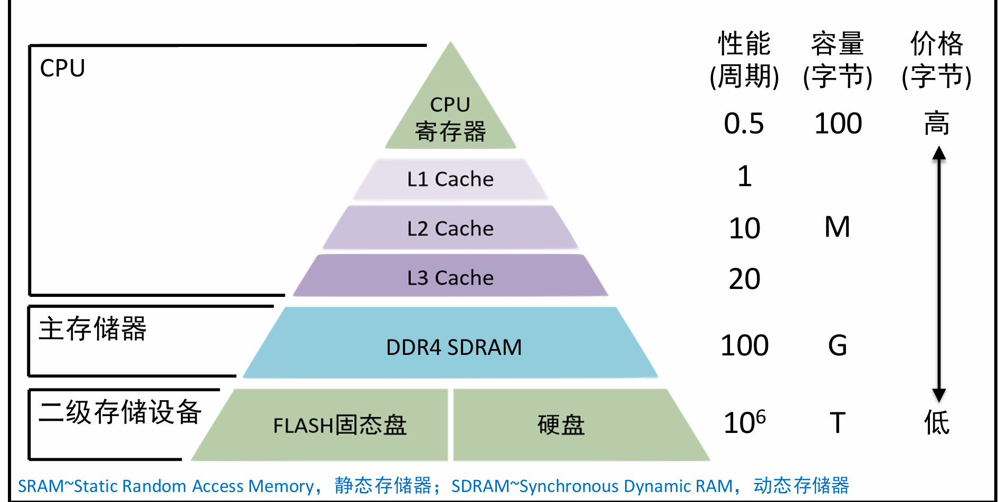
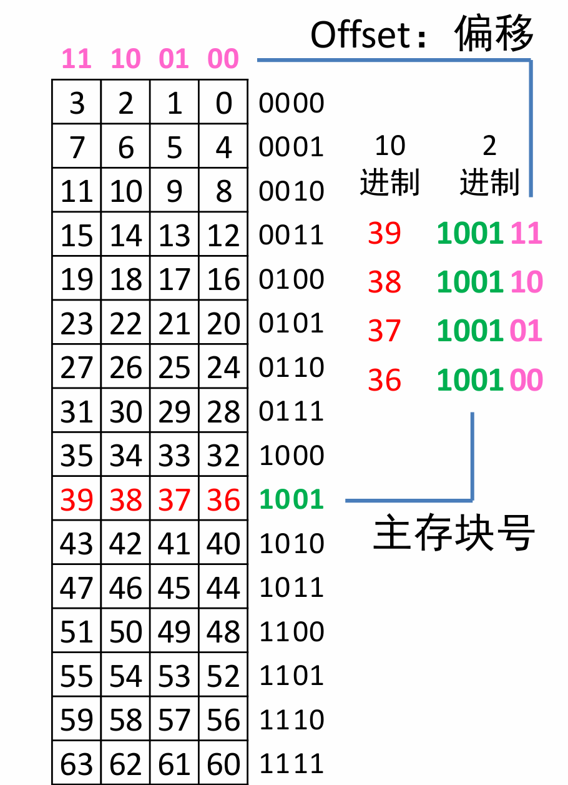
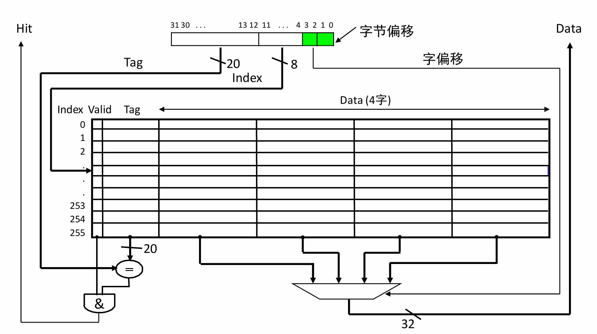

# L16 - Cache

+ **存储墙：** 处理器性能的增长远超于主储存器性能

主储存器DM（DRAM）的核心特点：**读取连续数据时，第1个数据等待时间很长，后续极快**

+ 因此结论1：处理N个字符约**需要5N指令** CPU**理想执行时间：5N个时钟周期**
  + 但由于DRAM读取第一个数据时间很长（20倍） 基本结论2：**CPU约执行104N个时钟周期**


## **局部性原理**

+ 时间局部性，如果某个纯储存单位被引用，那么不久后它会再次被引用
+ 空间局部性，~，它**相临的存储单元**可能很快会被引用
+ 因为顺序执行、循环结构、数组使用等特性

```c
while(*p++){
	i++;
}
```


## 计算机的储存层次



**CPU寄存器----主储存器----二级存储设备，离CPU寄存器越远，性能越来越低，容量越来越大，价格越来越便宜**	

## **Cache:  解决CPU-主存性能匹配的关键**

### **主存：** **抽象理解为二维数组**

+ **主存地址**：数组下标
+ 不妨设主存地址为6位，则共有2^6 = 64位空间，4位为**一块**，则有**16块**
+ **如何表示地址**?
  + **地址 = 主存块号（每一块第一个位的地址） + offset**



### Cache（重点理解）

+ Cache地址： 16位
+ 块数：4块 
+ **如何表示？： Index Tag Offset TIO结构** 
  + Index: 索引，定位Cache块号 
  + Tag: 剩余的储存位数（高位），与储存的tag'比较
  + Offset: 定位块内的偏移
  + Valid: **表示是否包含有效数据**（否则，初始化后Tag为0，也有可能命中）
+ **固定一对多**


### 读取流程示例

假设CPU读取00**10**11（B）

+ 00： Tag； 10:  Index;  11:  Offset

1. **根据Index读取Cache块**

2. **比较Tag，看主存块是否在Cache中，如果命中，进入3，**

3. **定位单位，根据offset判断位置，读取数据**

   **（如果命中，只需要5周期）**

4. **如果没有命中，则读取DRAM，并读入Cache（需要104周期）**

### TIO的一般计算方法（重点！）

**设主存地址位数为A**

+ **Offset = $log_{2}块大小$**

+ **Index = $log_{2}Cache块数$** 其中， $Cache块数 = \frac{Cache数据大小}{块大小}$
  + Cache一般标注的总大小指的是**数据的大小**
  + $Cache总容量 =  cache块数×(数据位数+ Tag位数+ Valid位数) = 2^{index} \times (8\times2^{offset} + Tag + 1)$
  + 
+ **Tag = A - I - O，即剩余的头部位数**


### 计算例：


#### 基本参数
- 主存地址空间：16MB
- cache容量：16KB
- cache块大小：4W       **4word = 4 * 4 Byte**


#### 主存地址TIO结构
- 主存地址位数：$\log_2(16\text{M}) = 24$位      **16M = 16 * 2^20**
- Offset（偏移）：4W对应16B，偏移位数为 $\log_2(16) = 4$位
- Index（索引）：$\text{cache容量/块大小} = 16\text{KB}/16\text{B} = 1\text{K}$，索引位数为 $\log_2(1\text{K}) = 10$位
- Tag（标记）：主存地址位数 - Index位数 - Offset位数 $= 24 - 10 - 4 = 10$位


#### 按照TIO切分地址（位范围：23~0）
| Tag（23~14） | Index（13~4） | Offset（3~0） |
| ------------ | ------------- | ------------- |
| 10位         | 10位          | 4位           |


#### Cache容量计算
公式：
$$
\text{Cache容量} = 2^{\text{Index}} \times (8 \times 2^{\text{Offset}} + \text{Tag} + 1)
$$
代入数值：
$$
\text{Cache容量} = 2^{10} \times (8 \times 2^4 + 10 + 1) \quad \text{位}
$$


## 直接映射Cache

#### 基本参数

- 主存地址空间：32位地址
- cache容量：4KB
- cache块大小：4W       **4word = 4 * 4 Byte**

#### 基本术语

+ **命中 Hit**：  Tag比较成功，主存块在Cache中，可快速读取
+ **缺失 Miss**： Tag比较失败，主存块不在Cache中，必须从主存中读取该块
+ **Cache块替换：** 当前Cache块存储的不是CPU请求的主存块（Tag失败），从主存中读取该主存块，并将当前Cache块替换
+ **Cache效率参数：命中率（Hit Rate，HR），缺失率（Miss Rate，MR）**
  + 命中率：对于一段程序，**命中次数占总存储访问次数的比例**
  + HR + MR = 1
+  **Cache延迟参数**
  + 命中时间（Hit time，HT）= 读取标签，判断，读取数据，选择正确的字，**访问cache的时间**
    + 如果缺失，也需要有这些事件，但还需要加缺失代价
  + 缺失代价（Miss penalty，MP）：从下一层存储器读入一个cache块的时间

#### Cache失效的原因 ----- 3C

+ 强制  Compulsory ：冷启动或者进程切换导致的首次访问

+ 容量  Capacity：不可能包含所有的主存块

+ **冲突 ** **Conflict : 多个主存块映射到了同一个Cache块**

  + **例子 ：A，B刚好是冲突单元，频繁访问的数据发生冲突**

  + **解决方案：尝试更改变量储存位置**

  + ```
    for: 访问A then 访问B
    ```

    > 懂得体系结构的重要优化方向

#### 读取Cache的结构线路

1. 根据11-4 取出index位置的一行
2. 比较31-12与cache的tag，如果相等且valid，则命中了
3. 根据4-3字偏移（一个单位为一字）通过MUX选取Data




+ 不全：还需要从**主存调入**Cache，从**CPU写入**Cache，从**Cache写入主存**

### 提高Cache性能

+ **利用局部性，增加块的大小**

+ 但在实际情况中 **块的容量恒定**
  + **块的容量 = 块大小 * 块数**