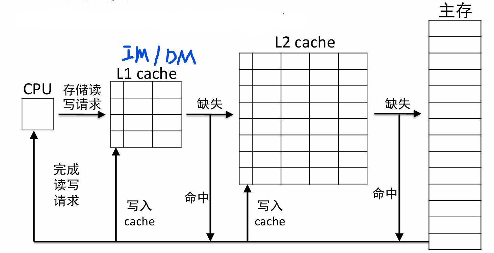
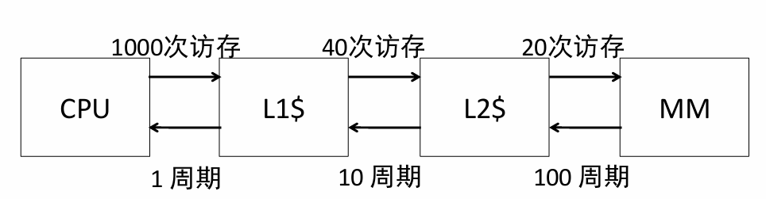
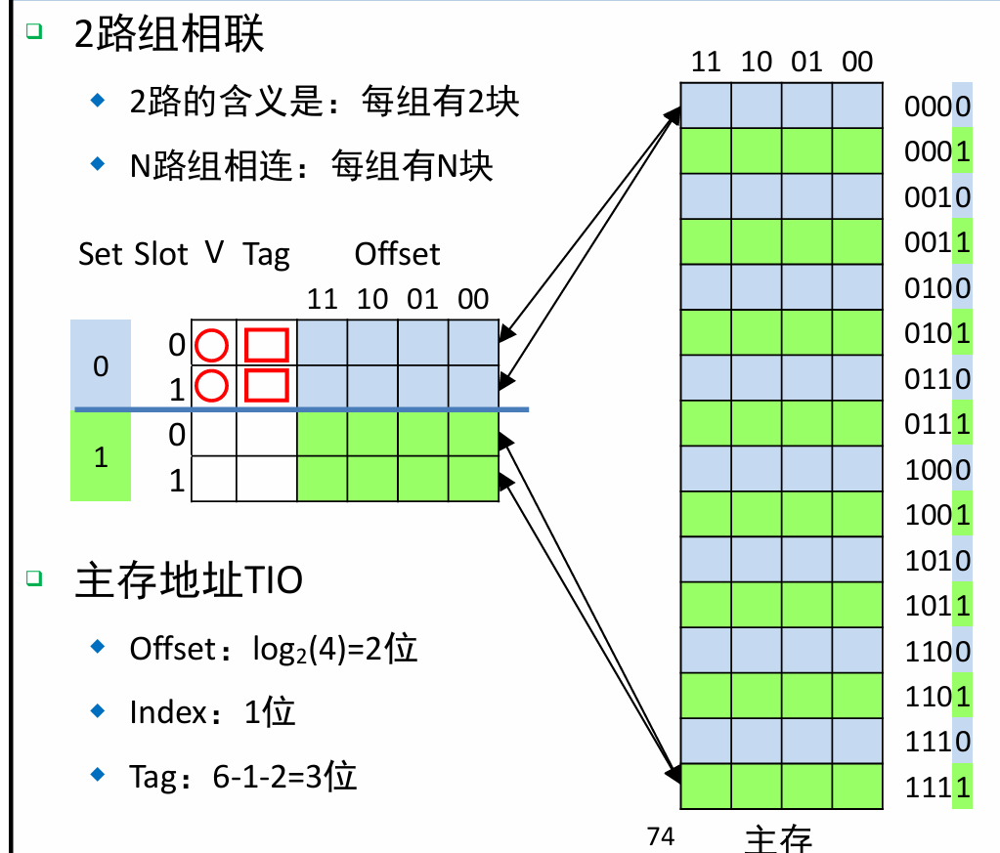
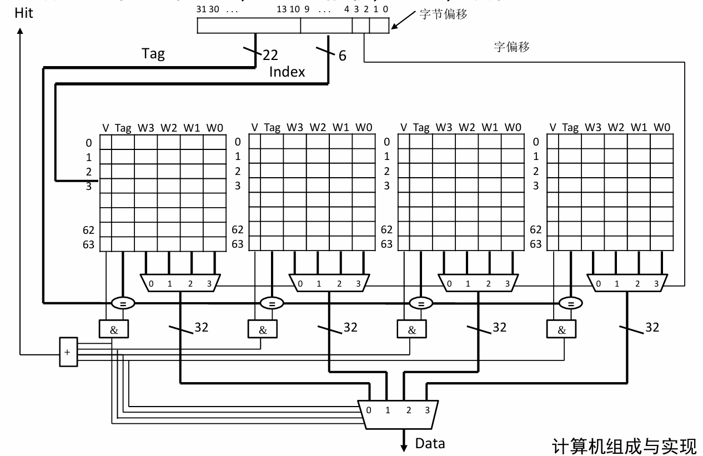

# Cache-2 高级Cache架构

参考:gxp课堂，USTC CO lab

## 多级Cache

### 多级Cache架构

**在CPU与主存之间引入多级Cache**

1. L1：性能高，容量小
2. L2-Ln：性能低，但容量大

**下一级包含上一级的数据**：如，L2cache一定包含L1cache内容。

**如何写入：主存 -> L2 Cache -> L1 Cache**

### 多级Cache AMAT计算 - 影响MP

+ **AMAT = L1HT  + L1MR * L1MP**
  + **L1MP**现在依赖于L2性能
  +  **L1 MP = L2 HT + L2 MR ×L2 MP**
  + ......以此类推，迭代 **MPi= HTi+1+ MRi+1×MPi+1**
+ **最后一层MP就是访问主存时间**

### 全局缺失率与局部缺失率

+ 局部缺失率：对于某层Cache的缺失比例 = **这一层缺失次数 / 上一层缺失次数**
+ 全局缺失率： **Ln缺失次数/L1访问次数，或者每一级缺失率乘积**
+ 性质：全局 <= 任意一级缺失率

### 全面的性能公式

### 每一层设计考虑

1. **L1$ 缩短命中时间**
   - 最小化HT来提升时钟频率
   - 容量小
2. **L2 L3 聚焦在减少缺失率**
   - 容量通常比较大

## 组相连Cache

### 背景问题

**Index相同的数据只能放在一个Cache Line中**

+ 核心关键：一个Cache Set 包含多个Cache Line（路）
+ 这样当一个块被占用时，若一个index相同的数据，就不必替换已有的数据，而是使用空闲槽位。

###  n路组相联

- N路，指的是**每组有几块**
- 此时Index，对应的是**组号**
- 现在可以有**多个Index相同的块放入到Cache中了**
- 性能上，性能最大改善发生在从直接映射改为2路组相联

### 计算TIO结构

+ Offset = $log_{2}块大小$ 
+ （变化）**Index = $log_{2}Cache组数$** 其中， $Cache组数 = \frac{Cache数据大小}{块大小\times 每组路数}$
+ Tag = A - I - O，即剩余的头部位数

### 实际线路：

+ **N路组，主体是N个直接映射的Cache，需要N个多路选择器，和N个比较器**

## Cache块的替换策略

### 随机替换

### 最近最少使用（least recently used）

+ 硬件记录cpu访存历史，**替换最长时间未被访问的cache块**
+ 对于组相联cache，**每组设置1位的标记**
  + 当访问了X路，就标记为X路取反，表示最近没有使用的那一路
+ 缺点：耗费太多算力资源

> 操作系统会接着讲

## 几种cache组织方式的对比

**直接映射 ---  组相联  ---  全相联**

+ **相联度越高，组数越少，组内冲突少，但实现代价大**
+ 全相联：极端，多路选择器太大！（虚存）

## 改进Cache

### 减少HT

+ **更小的cache**，这样检查查找时间变短
+ 例如，只有一个块的cache

### 减少MR

+ **更大的cache**（capacity）
+ 更大的块（改善conpulsory）
+ 增加相联度（改善conflict）

### 减少MP

+ **更小的块**（减少copy时间）
+ 多级cache
+ write buffer

### 如何折中

#### 策略

1. **写通 vs 写回**
2. **写分配 vs 非写分配**

取决于应用特性：例如手机、PC、服务器（科学计算）

> 单程序大数据 Intel，多程序数据集不是很大 AMD

