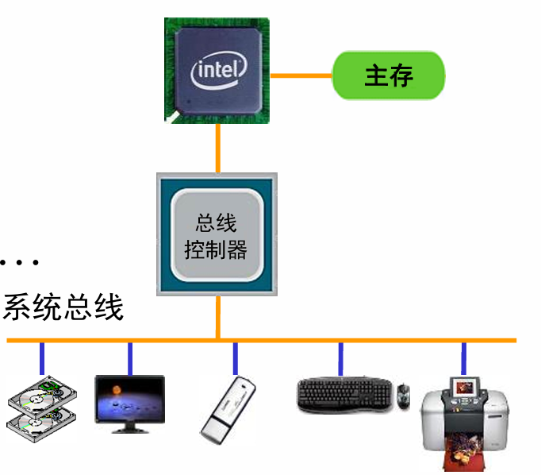
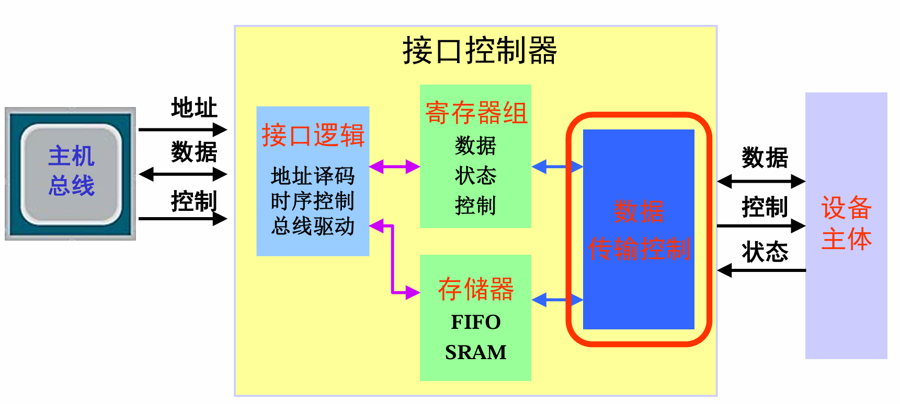
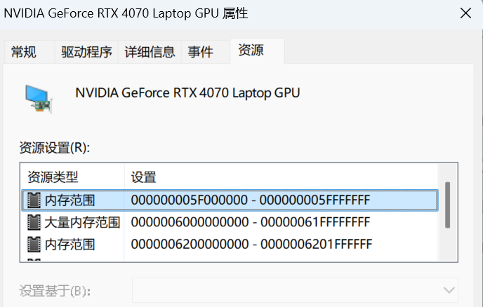
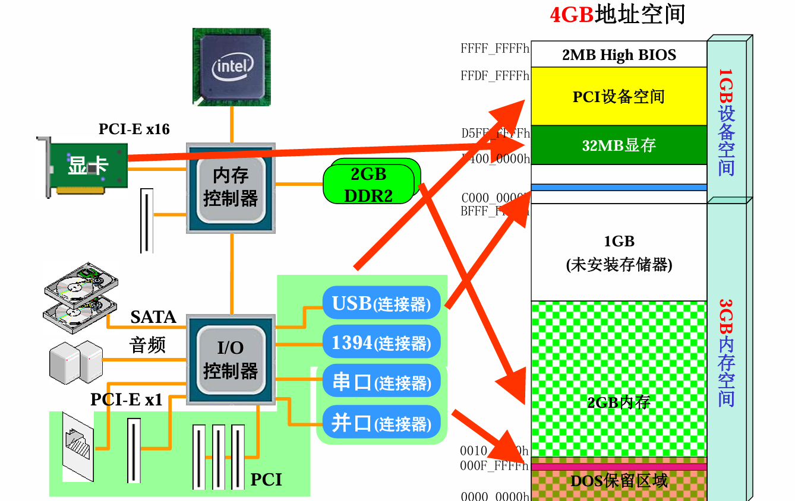
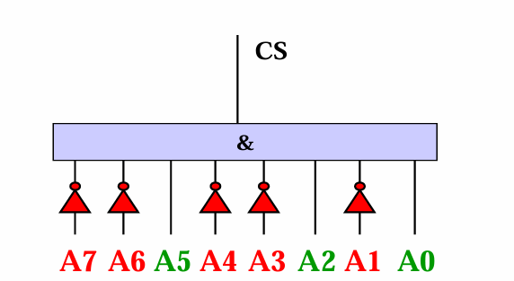

I/O接口，CPU区域、拓展区域、内存区域

**南桥区域：**

+ 原来分为南北桥，北桥负责接内存、显示器
+ 南桥负责....，但后来北桥集成在CPU里了

## 计算机硬件结构

**CPU的连接能力**

1. 主存
2. 显示器（内置显卡）
3. **系统芯片（bridge）**

**系统芯片**

1. 内置控制器：SATA、USB、LAN、WIFI、定时器、中断控制器
2. 各类芯片：音频、电源、时钟、BIOS
3. PCI-E插槽：固态盘、独显

## 计算机硬件结构的抽象

**CPU：信息处理**

**内存：程序IM/数据DM**

**设备：计算机与外界交换信息的通道**

# 设备与主机相连

## 硬件-接口控制器 

❑目标：CPU与外设(被控对象)在硬件上连接构成 一个有机整体

 ❑方法：I/O接口电路(接口、接口控制器) 

## **软件**：

 ❑目标：控制设备工作方式，完成信息传送 

❑方法：接口控制程序(或**驱动程序)**

## 连接思路

**Q1: 设备如何接入计算机** 

+  接口控制器/接口电路

**Q2: 接口控制器如何呈现？**

+ A2：接口控制器中的寄存器，**类比lw指令，将设备“伪造成”一个地址**

**Q3: 程序如何访问接口控制器**

+ 读写映射到**CPU地址空间**的接口控制器的寄存器

+ CPU地址空间中，为每个设备**分配互不冲突的区域**

+ 接口控制器通过**对CPU传来的地址译码**，进行控制

## 实例：

### 硬盘：

1. 硬盘接口控制器
2. 盘体（磁头、盘片、电机）

## 接口控制器

**为什么接口控制器与主机相连**

1. 速率、协议时序、数据格式、信号电平不匹配

**功能**

1. 地址译码
2. 接受CPU编程：**设置**模式、**控制**过程、**查询**状态
3. 缓冲（缓存数据）：解决和CPU速率不匹配
4. 时序控制
5. 与CPU交换数据，电平信号变换，中断

**组成**

+ **寄存器**：主机发来的程序，对控制器内寄存器组进行读写，进而与设备主体交互

**主机内部总线：PCI-E、PCI**

## 如何在CPU地址空间分配地址？

### **设备、主存统一编制在CPU的地址空间**

**例子：**

### 地址图： 将CPU地址划分为若干区域

+ **32位 -- 2^32 = 4G的地址空间**
+ **原则：互相之间不重叠**
+ 

### 1-存储器映射编址（Memory Mapping）

+ 将设备的寄存器（或存储器）视为主存单元，并分配地址 
+ **与主存单元一起在CPU地址空间统一分配地址**

+ 主流编址方式(PowerPC、MIPS …)

### 2-独立编址（早期x86）

+ CPU有两个空间：**存储器空间，I/O空间**分离
+ 用一位特殊信号，来区分址是访内存单元 还是访问I/O端口

## 接口控制器如何判断程序 是否读写自身？

### 地址译码

### 与特定地址比较：

类比controller 判断opcode是否对应特定指令

### 与特定区域比较

思路：只要看高位，看地址范围里**不动的地方**

#### **基地址(Base)+偏移范围(Offset)** 

+ 地址译码**主要是比较Base部分** 
+ offset：用于内部寻址

**例子：判断A ∈{C0h～DFh}**

+ S1：分析起始地址 起始地址：1100_0000b 结束地址：1101_1111
+ S2：确定不变地址位 A7，A6，A5 (注意：偏移区域是满的) base = 110x_xxxxb 
+ 判断A ∈{C0h～DFh}→A[7:5] =?= 110b

#### **偏移区域不满怎么办？**

例如，5,6,7位不变，4变化，3不变

+ **拆分区域为若干满偏移区域**

**Q：判断A ∈{C0h～D7h} 起始地址：1100_0000b 结束地址：1101_0111b**

+ 方法：拆分区域为若干满偏移区域 等价于判断A ∈{C0h～CFh} | A ∈{D0h～D7h}

## 读写设备的全流程

+ S1：取指令 CPU输出地址，主存返回数据(实际为指令) 
+ S2：译码
+ S3：取操作数 操作数在寄存器中 
+ S4：ALU计算地址 
+ **S5：写显卡寄存器**

### S5：写显卡寄存器

1. CPU产生写周期：WD, A3，WREn
2. Bridge: 响应，译码，产生系统**总线写周期**
3. 显卡：与其他所有设备同时侦 听总线，分析地址，将数据写入内部寄存器

+ lw/sw指令 - CPU地址空间 - 设备地址译码

**这个时候设备是如何知道自己在整个空间的地址呢？**

+ 早期：在设备上用开关，设置该设备的地址（开关：1100 = 开开关关），然后与传来的地址比较。
  + 板卡：解码器，光盘驱动电路
  + 问题：调整一个设备的地址，软件也需要同步调整，其他设备都要跟着调。

+ 如今的方法：对于设备，用一组**寄存器**表示该设备基地址。(基地址寄存器)
+ **计算机设备的核心技术：P&P** Plug and play.
  + 开机时，扫描板卡，获取设备数和每个设备的容量大小
  + 在CPU地址空间中，划出来一个小区域专门用来存放各个**设备的基地址**，表示每个**插口**地址陈内的**设备地址**是什么
  + 通过**Bridge**产生一个 **CS** 信号，一旦设备插入，通往该设备的CS信号为真（基地址寄存器写使能），就可以让**CPU把基地址sw进去**
  + 例子：设备插口2的地址为A004, 设备2插入后，发出指令 sw XXXX A004, BridgeCS信号为真(CS = (A == A004))，就可以把XXXX（设备地址）存入到设备基地址寄存器（BASE）， 这样 CPU要和这个设备互动时，发出地址，这个设备内和设备地址比较，如果相等，则把设备设置信息存入到设备寄存器中。

