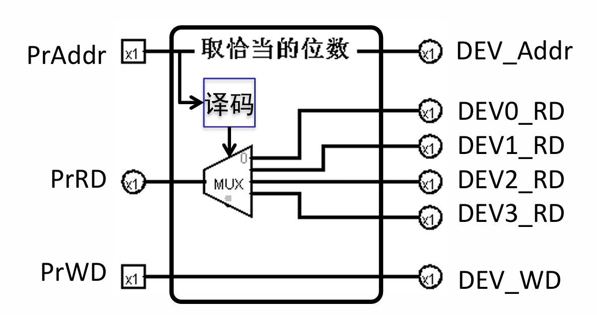
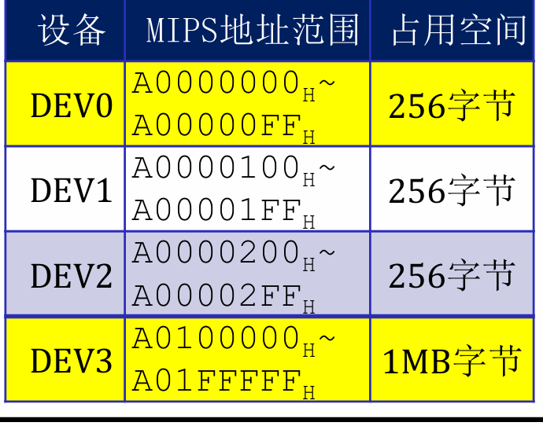

+ lw/sw指令 - CPU地址空间 - 设备地址译码

**这个时候设备是如何知道自己在整个空间的地址呢？**

+ 早期：在设备上用开关，设置该设备的地址（开关：1100 = 开开关关），然后与传来的地址比较。
  + 板卡：解码器，光盘驱动电路
  + 问题：调整一个设备的地址，软件也需要同步调整，其他设备都要跟着调。


+ 如今的方法：对于设备，用一组**寄存器**表示该设备基地址。(基地址寄存器)
+ **计算机设备的核心技术：P&P** Plug and play.
  + 开机时，扫描板卡，获取设备数和每个设备的容量大小
  + 在CPU地址空间中，划出来一个小区域专门用来存放各个**设备的基地址**，表示每个**插口**内的**设备地址**是什么
  + 通过**Bridge**产生一个 **CS** 信号，一旦设备插入，通往该设备的CS信号为真（基地址寄存器写使能），就可以让**CPU把基地址sw进去**
  + 例子：设备插口2的地址为A004, 设备2插入后，发出指令 sw XXXX A004, BridgeCS信号为真(CS = (A == A004))，就可以把XXXX（设备地址）存入到设备基地址寄存器（BASE）， 这样 CPU要和这个设备互动时，发出地址，这个设备内和设备地址比较，如果相等，则把设备设置信息存入到设备寄存器中。


## CPU 支持I/O

**类似于DM：Addr, Dout, Din**

+ **CPU不能单独** 为每一个设备提供数据/地址，否则使得CPU设计过于复杂

### Bridge 模块

+ 功能：完成地址、数据转换、控制信号CS产生
+ 结构
  + 
+ 回顾：**地址图**

#### Bridge 如何译码

+ 回顾如何判定地址在范围里，补充：**由于是32位二进制，对于任意地址范围来说每一位要么不变，要么只取0/1（在0-1范围浮动）**

**因此只需要找到不变的那几位判定是否相等**

+ 例子：0号设备的命中信号：`HitDEV0 = （Addr[31:8] == A00000);`



#### Bridge如何写入设备

+ 写数据直通设备
+ 每一个设备的写使能信号需要满足两个条件：CPU传来写使能信号，且地址命中
  `assign WeDEV0 = WeCPU & HitDEV0;`

#### Bridge如何读数据

+ 硬件设计思路：每一个都要输出，再MUX选择出来

+ `assign PrRD=HitDEV0 ?DEV0_RD: HitDEV1 ?DEV1_RD: ... DEV3_RD;`

### CPU的改造

1. 数据存储器**DM的写使能信号**也需要判断地址范围是否命中DM
   +  `DM的实际写入信号= m_DMWr & HitDM`
     + 其中HitDM 同理Bridge译码。

2. DM读出数据- RF回写数据MUX需要增加一路，来判断来自DM还是来自设备

```verilog
MUXWD_Sel = load指令 & HitDM  ? DR@W  :
			load指令 & !HitDM ? DIn@W :
			cal指令           ? AO@W  :
			                   PC4@W
```

2. 

设备--DM，对齐到M级，解决DM写使能，回写数据选择