# VM 虚拟储存器

> 访问一个大的集合，加速-找局部性。

我们的需求：

+ 连续的主存、特定的地址启动、无限主存、独占计算机

VM提供：

+ 连续的存储**视图**、所有程序都从相同地址启动（映射规则）、无限主存、共享与存储保护
+ 代价：页表的访问，页表存储在硬盘中，（缺页异常）

真实情况：

+ 不连续的存储空间、主存任意位置启动、有限的主存、同时要运行多个程序

所以，VM如何实现：

+ 把存储器分块（页面）
  + 因而产生了PPN,offset，由此对应VPN,
+ OS负责**虚实转换**的**页表**（指定了位置）
  + 页表：以VPN为下标，以PPN为页表项
  + 负责缺页异常程序，向硬盘读入数据
+ 主存是硬盘的cache（内存无限）
+ 根据局部性原理，把主存常用的页表项放置在cache，TLB是页表的cache
+ CPU发出虚地址 -- TLB -- 给出物理地址（I/M）-- 送往指令/数据cache

## CPU地址与存储器地址的关系

+ 对于load/store指令，CPU地址：ALU计算产生

+ 常规想法：ALU_0  -- A0     ALU_1 -- A1

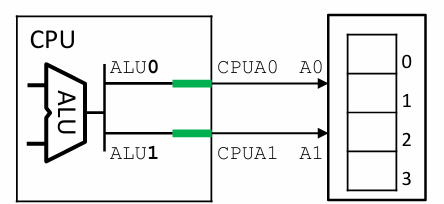

+ 非常规想法：ALU_0 -- A1   ALU_1 -- A0

  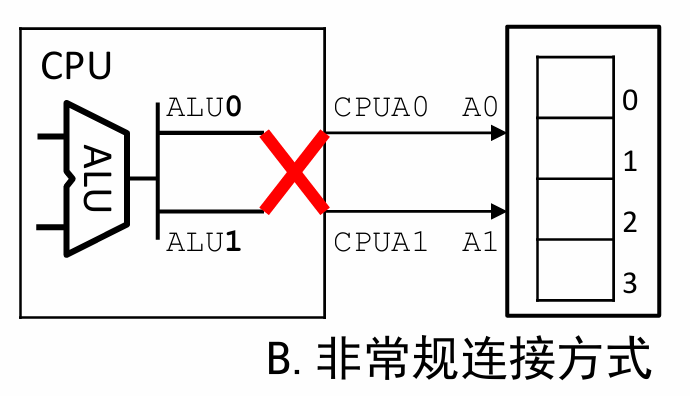

  + 从程序员视角来看，这两者对于load/store指令等价，因为ALU计算结果相等，映射一样
  + ALU的计算结果，和主存连接关系（cpu 地址与存储器地址的映射）可以改变

## 问题背景

+ 针对每个程序需求，都会有相应的基地址和边界
+ 这样会产生大量碎片空间，但是不连续

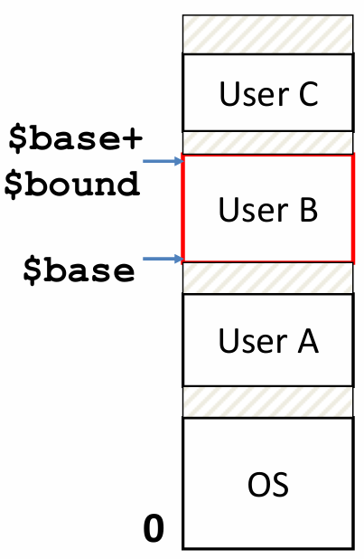

> Java 的垃圾回收机制：把不连续的存储空间拷贝，放到连续的地址空间

## 概念

### 虚拟地址 VA（virtual address）

+ **ALU产生的地址计算结果**

### 物理地址 PA

+ 存储器单元**实际的地址**
+ **物理地址空间**：全部物理地址构成的集合

##  基本原理

### 使用物理地址的系统

+ 对应常规想法
+ VA PA直接连接在一起 VA == PA
+ 例如：嵌入式、汽车刹车

### 使用虚拟地址系统 

+ 对应非常规想法

+ 引入 MMU（memory managment unit）
+ VA通过MMU转换为PA
+ 例如：PC，服务器，手机

## 地址转换

+ 每个程序使用自己的虚拟地址
+ 程序之间保护
+ **OS**决定程序具体运行在**内存的哪个区域**
+ 而**硬件**实现**虚拟地址到物理地址的转换**

### 分页 page

+ 类比cache的分块
  + 在虚存和主存都分为固定大小的若干块，每一块称为**页**(page)
+ **页内偏移（page offset)** 
+ **虚页面** virtual page + offset      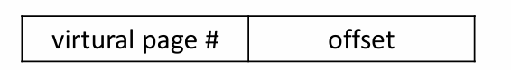
+ **实页面**physical page + offset    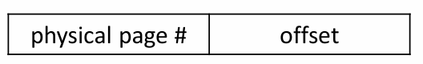

#### 计算拆分结构，类比cache

+ 页面容量为4KB；虚存空间、主存空间均为1MB
+ offset 位数 = **log2(2K)**
+ 虚拟页号 = **log2(1M) - offset位数**
+ 物理页号 = log2(1M) - offset位数

## 页表 page table

### 核心功能：输入虚拟地址，输出对应物理地址，对应表格

+ **保持offset一致，根据输入的虚拟页号，得出对应的物理页号**
+ 

### 实现方式

+ **数组：下标是虚页号，内容是物理页号**
+ **页表项 PTE page table entry** 每一项内容
+ **Valid位**：指示该物理页面是否有效（是否在**主存**中）
+ **AR access right位**：指示页面的各类访问权限
  + read only，read/write, executable(可以读取指令)

> 程序报错：Segment fault，该页面只读，但你写了，或者不可访问（例如）

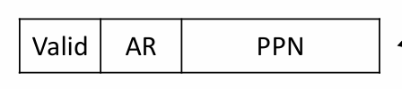

### 流程

1. VPN作为页表下标，选择
2. 检查valid和权限
3. 把读出的PPN与offset拼接，作为物理地址输出，访问主存

## 虚拟储存层次

+ 类比“cache-主存”结构，引入分页，构成**“内存-硬盘”虚拟储存结构**
  + 存储空间增大；每个程序使用自己的虚拟地址，方便程序运行；共享与安全性

### 页表项扩展

+ DP：disc page 硬盘页数
+ 由于引入了硬盘空间，所以**PTE记录的既可能是主存页数，也有可能是磁盘页数**

### 页命中 page hit

+ **CPU要访问的数据已经在主存中**
+ **valid == 1**

### 缺页 page miss

+ **cpu要访问的数据不在主存而在硬盘中**
+ 执行缺页异常程序：替换一个虚页
  + 将要被替换的虚页PTE valid设为0，把硬盘地址拷贝过来
  + 把硬盘空间VPX复制到主存的PPX中，并据此建立PTE的valid和PPN
+ 重新执行该指令

### 分配页面

系统不可能完全预知程序的存储需求，因此需要**动态分配虚页面**

> C语言 malloc()申请空间

### 支持写

+ Dirty位：表示该物理页面是否被写过
  + OS在替换页面时，如果dirty为真，说明主存被修改过，要保存结果，那么就要先把页面回写进硬盘

## TLB ——页表的小cache

>  **Translation lookaside buffer**   

### 页表储存在哪里？主存!

+ 对于cache太大了，无法储存在其中
+ 但主存，会导致load/store访问过慢
+ **因此页表项也可以做一个小cache**
  + 做成全相联，因为总PTE不是很多
  + 不需要单独的offset

### TLB表项格式

+ Valid、Dirty、AR与PTE一致
+ **TLB tag: VPN mod TLB表项数**
+ **Ref: 用于实现LRU替换算法，位为1表示该位被访问过。**

### 示例-TLB表项结构

#### 参数

+ **页面大小**
+ **虚地址总位数**
+ **主存大小**
+ **TLB的表项数（总大小），路数**

#### 计算

+ **offset位数**：log2(页面大小)
+ **物理页码PPN位数**：**Log2(主存大小) - offset位数**
  +   ----- cache每一块存储的内容
+ **虚页码 VPN位数**：虚地址总位数 - offset位数
+ **TLB组数**：TLB表项数/路数
+ **Index位数**： log2(TLB组数)
+ **Tag位数**： **VPN位数 - Index位数**   
  + 不需要offset

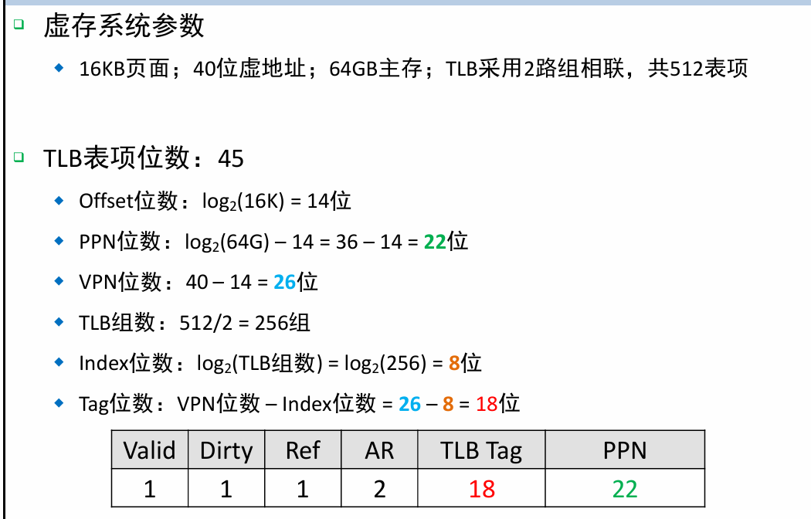

## TLB与cache的集成

### **核心：虚实变换之间**

+ 指令TLB: PC - 指令TLB - 指令Cache（F级）
+ 数据TLB：EMReg - 数据TLB - 数据Cache （M级）

### 页表基地址寄存器

+ OS调度程序运行时，会把每个程序的**页表基地址**加载在**PTBR**中
  + PTBR: page table base register（单个寄存器）
  + 切换程序时，OS会切换页表基地址

> OS切换程序的核心：保存**上下文**。包含PC，通用寄存器，以及PTBR

### 页表 查找

当指令TLB和数据TLB缺失，通过页表查找：

+ 核心：将TLB发出来的缺失的VPN（虚页号）信息，加上PTBR，得到<u>**页表项的物理地址**</u>，然后再**向主存中的页表查询**
  + 为什么要加PTBR? 
  + <u> **虚页号范围取0~N-1**，加上当前程序的页表的起始地址（PTBR），自然就能得出**页表项在主存的位置**（**！注意是页表项的位置，而非页表内容PPN）**</u>

+ 发送到数据cache

### 数据通路

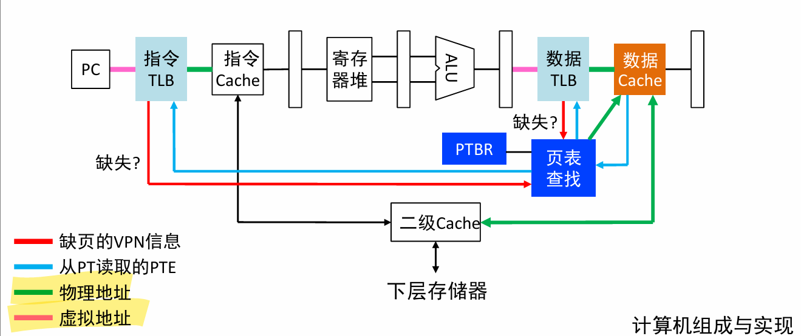

### 虚实地址转换流程

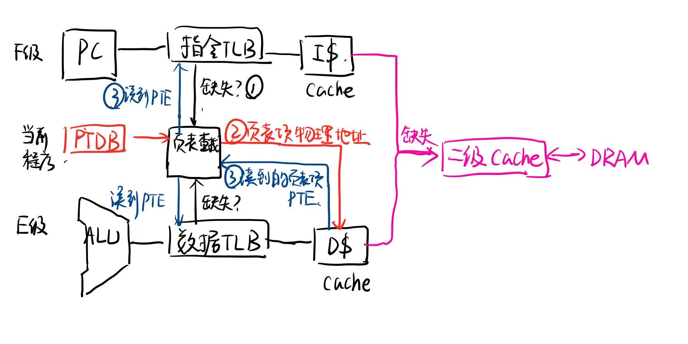

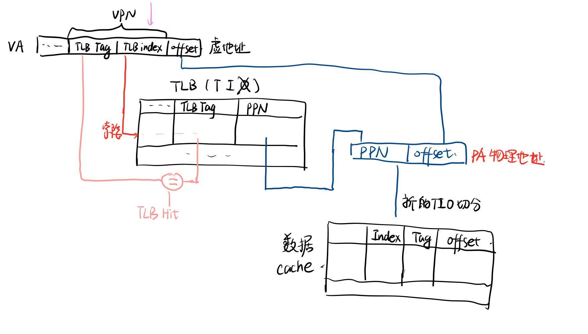

1. 检查TLB（VPN -- PPN）
   1. TLB命中，返回PPN给cache
   2. TLB缺失，检查页表
      - 页表命中，加载PTE到TLB，然后执行命中
      - 页表缺失，中断异常，OS介入，从硬盘加载PTE至主存，更新PTE，然后再...
2. 检查cache （PA -- 数据）
   1. cache命中，返回数据给流水线
   2. cache缺失：从主存加载数据至cache，然后返回数据

## 数据访问场景

**三个元素：TLB是否命中，页面是否命中(valid==1），Cache是否命中**

### TLB缺失，页面命中，cache命中。

### TLB缺失，页面命中，cache缺失。

### TLB缺失，页面缺失

（不可能）TLB缺失，页面缺失，cache命中

+ 原因：**未建立页面，主存中不可能有数据，根据存储层次的包含性原则，cache里也不会有（进行了无效化操作）**

### 数据在 Cache 中 $\Rightarrow$ 数据必定在主存中 $\Rightarrow$ 对应的页面必定已经加载并标记为 Valid。

## 虚拟存储系统的性能参数

### TLB缺失率

+ TLB缺失次数占总访问次数比例

### 页表失效率

+ 页表失效次数占总访问次数比例

## 存储共享

+ **虚存系统方便支持数据共享**
  + VPN1/VPN2 可以映射到同一个物理页面PP1（OS)

> 与 **消息传送** 例如copy / paste区别开，在于需要经过操作系统P1写调用，把数据拷贝到OS，然后P2读调用，这部分数据

## 存储保护

通过设置AR权限，限制程序对于存储器的读写

## 页面替换

+  与cache采用的伪LRU算法不同，**虚存系统采用完全LRU算法**
  + 因为从硬盘载入更慢

## 性能

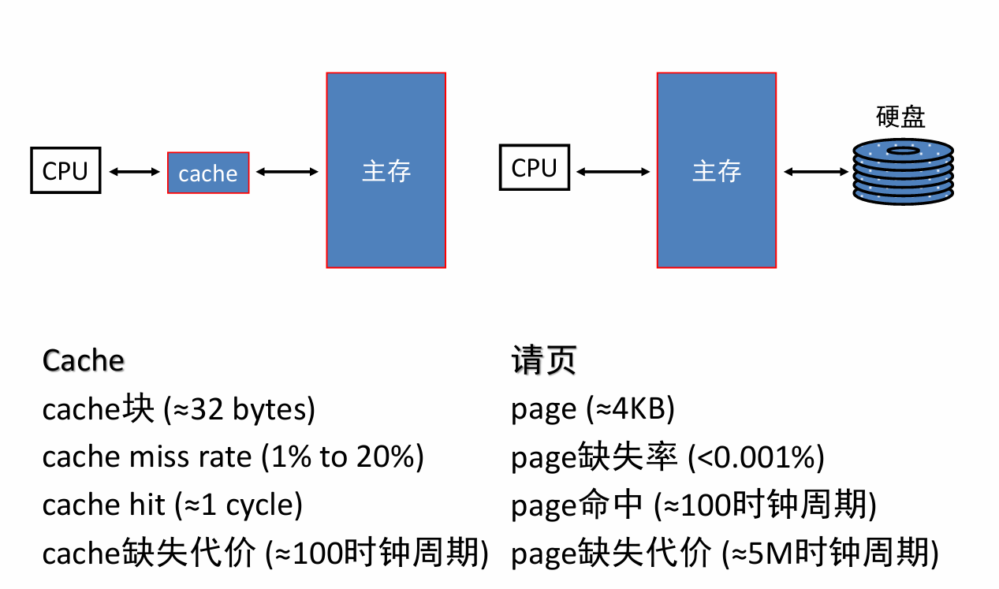

+ **page的命中时间长（所以TLB往往采用全相联）**
+ **page缺失代价极长 （所以就要采用真LRU算法来替换）**

+ 平均储存时间AMAT = 

