# 存储系统-物理器件

## 概述

### 存储器分类

+ 按照介质分类：半导体、磁介质、光盘
+ **按照访问方式：**
  + RAM：随机访问存储器
  + ROM：只读存储器
    + BIOS(basic I/O System) - 了解计算机所以输入输出、设备大小
  + 顺序访问存储器 Tape
  + 直接访问存储器 disk

+ **从使用场景**
  + 高速缓冲cache
  + 主存
  + 辅助存储器：硬盘、SSD

### 存储系统的层次

1-4级常用；越往上，性能越好，单位成本越高，大小越小

## 半导体存储器

### SRAM static RAM

+ 静态：只要不断电，写入就不变

### DRAM dynamic RAM

+ **SDRAM**： 增加了同步的寄存器S，与CPU采用相同时钟，避免了不必要的等待周期，
+ **DDR**: double data rate，在一个时钟的上升期和下降期各传输一次 数据
+ DDR1 - DDR2 - DDR3 - DDR4 - DDR5

### ROM

+ 极端情况可改变，可擦除可编程。
+ PROM：一次性可编程，0就是烧断
+ flash ROM: 快擦除存储器（闪存）（CF、SD）

## 存储单元电路

### 	SRAM：六晶体管单元电路

### 	DRAM：单晶体管单元电路

+ 同时Cs Cd两个电容，**需要不断充电，补充电荷（刷新）**
  + 也需要时间，性能低于SRAM

## 存储器芯片结构（重点）

+ 核心：**看做数组**
  + **数组大小为N，位数为log2N**，**即为所需要的地址位数**
  + 读出来的数据从低位到高位D0-D1-...-Dx

### 容量描述

+ 存储芯片容量的描述:2^n ×**m**（字单元数×**每个字单元的位数**）
+ 地址线：n位→2n个字单元，An-1..A0单向
+ 数据线：m位→m位/字单元，Dm-1..D0双向

### 二维地址结构

+ 实际，地址结构是**二维数组**（提高晶片的利用率）
  + 大小：$2^m \times 2^n, m+n = 地址位数$
  + 先用低m位决定第m行，再用高n位决定第n列

### DRAM芯片结构：

例子： **4096 * 4** DRAM 4096个字，每个字4位

+ 4096个字 -- 12位地址
+ **DRAM特殊，行列地址管脚复用，输入只有（一半位）**

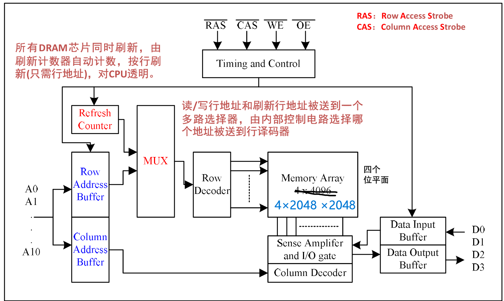

4M × 4 的DRAM芯片

+ 位数 22位
+ 输入 11位
+ **刷新计数器：按行刷新（与行位数一致）**

### SRAM芯片结构

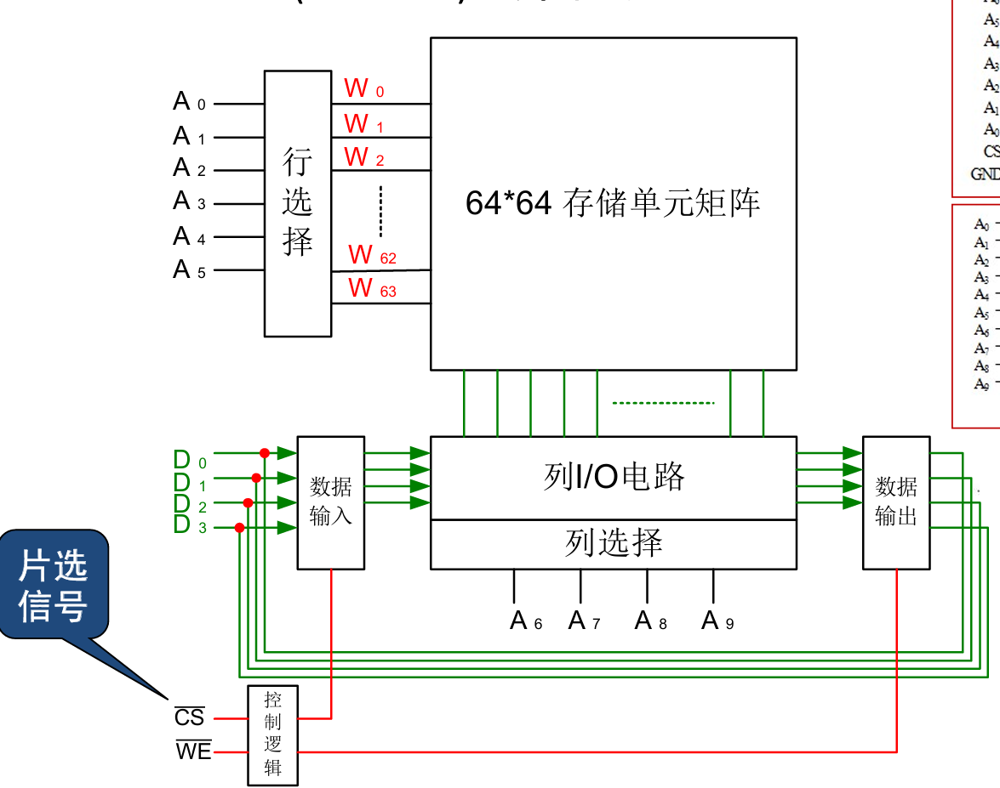

**CS: chip select，这个信号表示该芯片是否工作**

+ $\bar{CS},CS^*$指低电平有效

## 存储器的扩展

### 位扩展

+ **位数不能满足要求，但字空间满足要求**
+ **方法：数据位空间拼在一起**

例：1K ×**4** SRAM芯片构成1K ×**8**的存储器

+ 需要芯片：**（1K×8）/ （1K×4）= 2片**

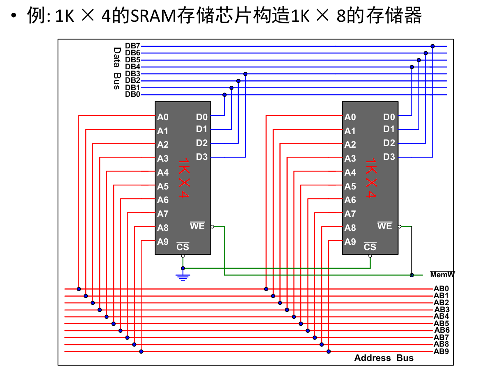

### 字扩展

+ **位数满足要求，但是字空间不能满足要求**
+ **方法：拼接字空间**
  + “多出来的”高位字空间，通过**译码器**，产生各个芯片的片选CS信号连接，去选择写入哪个**芯片**
  + **注意取反**
+ 计算：子空间相除，即为需要多少芯片
  + **对2取对数，就可以得到把高多少位的信号作为译码器输入信号**

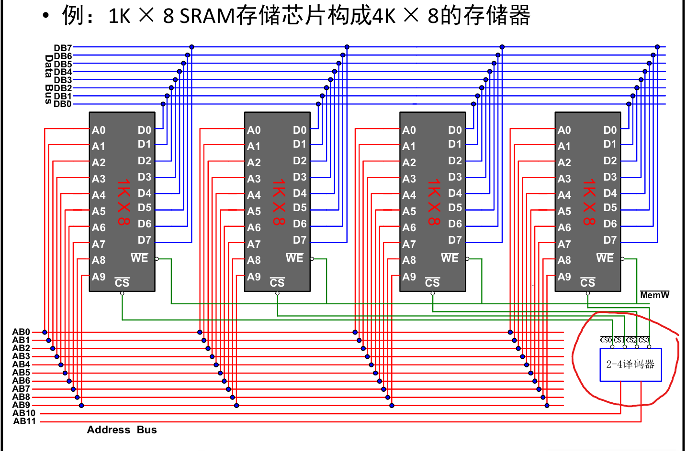

### 混合扩展

#### 先做位扩展，再做字扩展

+ 位扩展：单独把**字位数**相除，得到需要几个芯片进行位扩展
+ 字扩展：再把字空间相除，得到需要多少芯片进行字扩展
  + **把位扩展后的当做一个完整芯片**
  + **所以注意片选信号、输出信号、低位输入信号都要共同连入。**

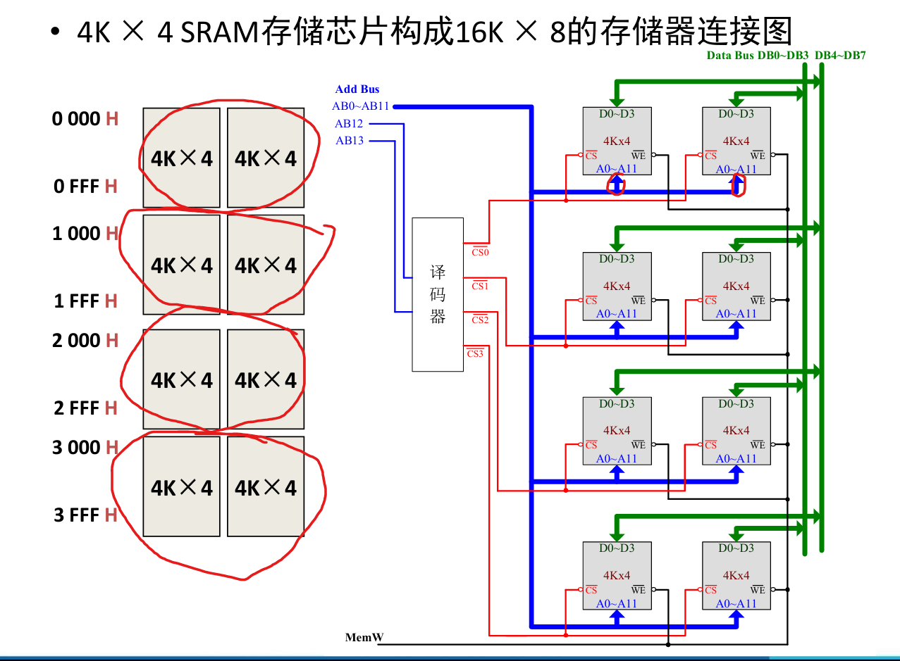

## CPU与主存的连接

### 例题

+ CPU地址线A15-A0，数据线D7-D0，WR#为读写信号，MREQ#为访存请求信号
+ 0000H~3FFFH为**系统程序区**
+ 4000H~FFFFH为**用户程序区**
+ 用8K×4 ROM芯片和16K ×8位的RAM芯片构成该储存器，方案？

### 分析方法

1. 确定每个芯片的地址管脚数、数据管脚数、地址空间
   1. 8K×4 ROM：**地址13位**，数据4位，地址空间0000H ~ 1FFFH
   2. 16K ×8 RAM: 地址14位，数据8位，地址空间0000H ~ 3FFFH
2. 确定整个存储空间**所需**的地址总线和数据总线的数量及地址空间
   1. 总空间：16位地址，8位数据，0000H~FFFFH 64K×8
   2. 系统程序区：ROM，**16位地址**，8位数据，0000H~3FFFH 16K×8
      - 注意：**分区，地址、数据位宽都不能改变**
   3. 用户程序区：RAM，**16位地址**，8位数据，4000H~FFFFH  48K×8
3. 计算所需存储器芯片的数量，确定每个存储器芯片在整个存储空间 中的地址空间范围、位空间范围
   1. 8K×4 ROM：16K×8/8K×4 = 2×2块
   2. 16K×8 RAM：48K×8/16K×8 = 3×1块 只做字扩展即可
4. 所有芯片的地址管脚全部连接到地址总线对应的地址线上（连接已有的，多余的最后处理）
   1. 将A0-A12连接到所有芯片对应的地址管脚，A13连接到所有ROM的地址管脚
5. 同一字空间的存储芯片CS信号连在一起
6. 同一位空间的数据线连在一起，并连接到对应的数据总线上
7. 根据每个存储器芯片的**地址空间范围**设计存储器芯片所需要的片选 信号逻辑
   1. 对于每一储存区：把高出来的n位信号作为译码器输入信号
   2. 分别产生2^n个片选信号 $\bar{CS{i}}$
      + 对于ROM：地址13位，需要16位，因此**高3位作为片选**
        + 只在两组间选择，因此XX0对应第一组，XX1对应第二组
      + 对于RAM：地址14位，需要16位，因此**高两位作为片选**
        + 在三组间选择，00, 01, 10, 分别对应一、二、三组

## DRAM的刷新

### 集中刷新

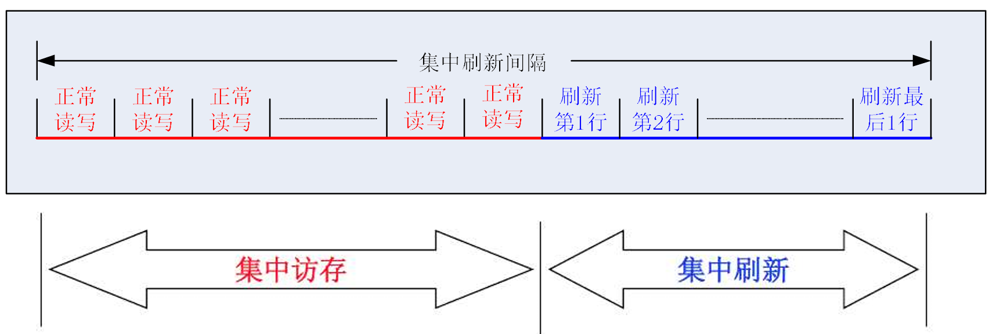

+ 在集中刷新时，存储器不能读写

### 分散刷新

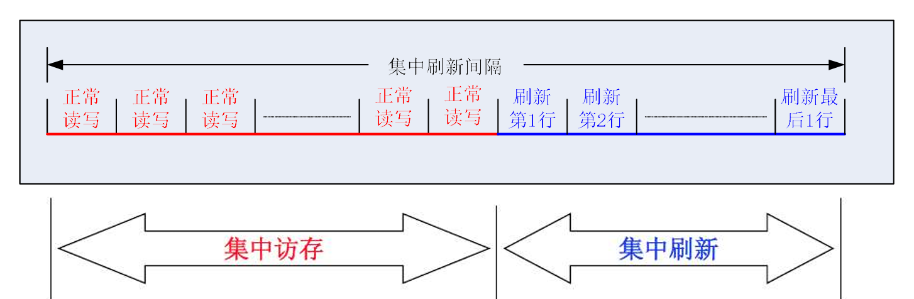

### 重点：异步刷新

**异步刷新间隔 = 刷新周期**

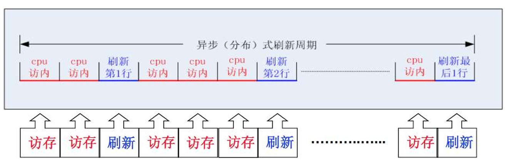

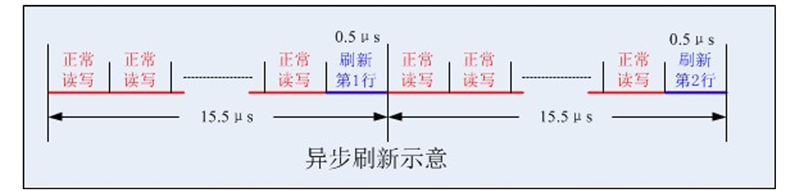

#### 例题

**一共128行，要求在2ms内必须全部每一行刷新一次，假定读/写与刷新操作时间都为0.5μs**

+ 每隔2ms/128 = 15.5us 刷新一行
+ 15.5us中，前15μs进 行正常读/写操作，**最后0.5μs完成刷新操作**

## 外部存储器

### 硬磁盘的基本结构

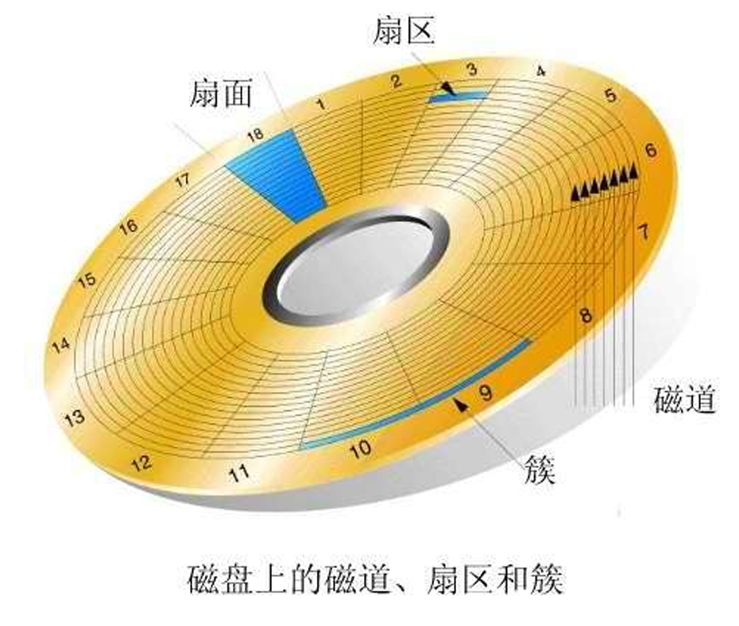

+ 磁道：同心圆环
+ 扇区：一个磁道包含若干扇区，**是磁盘读写的基本单位**
+ 柱面：**不同盘面相同半径**磁道构成的圆柱

问题：外圈更长，因此有一部分会浪费

+ 新技术ZBR：等长度分扇区，越往外，线速度越大，单位时间读取扇区数越高，传输率越高

> linux winNT的竞赛丑闻，把win放外圈，linux放里圈

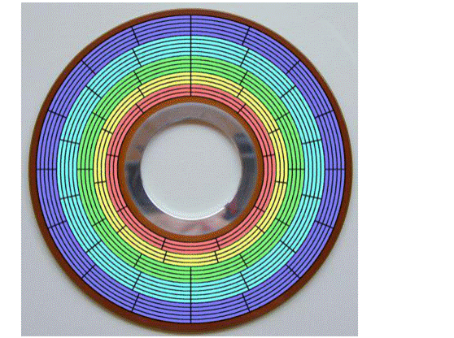

### 性能指标

#### 寻道时间Ts

+ 磁头从**当前位置**定位到**目标磁道**所需时间（平均）

#### 寻区时间Tw

+ 磁头**定位到目标磁道后**，等待**目标扇区**旋转到磁头下所需的时间（平均值）

#### 数据传输率Dr

+ 单位时间内传输的**数据位数**（b/s）

#### 例题

##### (1) 容量计算：数清楚“房间”总数

**一定注意每个盘有两个面，最外两侧盘面不能记录（2 * n - 2)**

$$容量 = 有效盘面数 \times 每面磁道数 \times 每道扇区数 \times 每个扇区大小$$

##### (2) 平均寻址时间：物理等待的总和

**平均寻址时间** = **平均寻道时间** + **平均等待时间（旋转延迟）**。

- **平均等待时间**：**磁盘转半圈的时间。**
  - 转一圈时间T = 1/f = $60\text{ s} / 7200\text{ rpm} = 1/120\text{ s} \approx 8.33\text{ ms}$。
  - **注意是rpm 一分钟多少转！**
  - **等待半圈 =** $8.33 / 2 = 4.165\text{ ms}$。
- **总时间**：$8 + 4.165 = 12.165\text{ ms}$。

##### (3) 数据传输率：一秒能读多少位

传输率取决于**磁盘转多快。**

- **计算**：每秒转数（$7200\text{ rpm} = 120\text{ r/s}$）$\times$ 每个磁道的数据量（$12 \text{ 扇区} \times 512 \text{ 字节} \times 8 \text{ 位}$）。
- **结果**：$120 \times 12 \times 4096 = 5,898,240\text{ b/s}$。
- **注意是多少位，需要×8**

##### **注意**：**一定要看清单位是 Bytes 还是 bits，时间是 $ms$ 还是 $s$**

### 硬盘分类-如何组织各个盘面

#### RAID0 无差错控制的带区组

+ Reduntant Array of Inexpensive Disks（廉价磁盘冗余阵列）

#### RAID 1：镜像结构

#### RAID 2：带海明校验

#### RAID 3：带奇偶校验码的并行传送

#### RAID 4：带奇偶校验码的独立磁盘结构

#### RAID 5：分布式奇偶校验的独立磁盘结构

## 光盘

+ 机制：数据记录凹点（Pit）表示0，Land 表示1
  + 根据反射光的强度判断是0还是1

