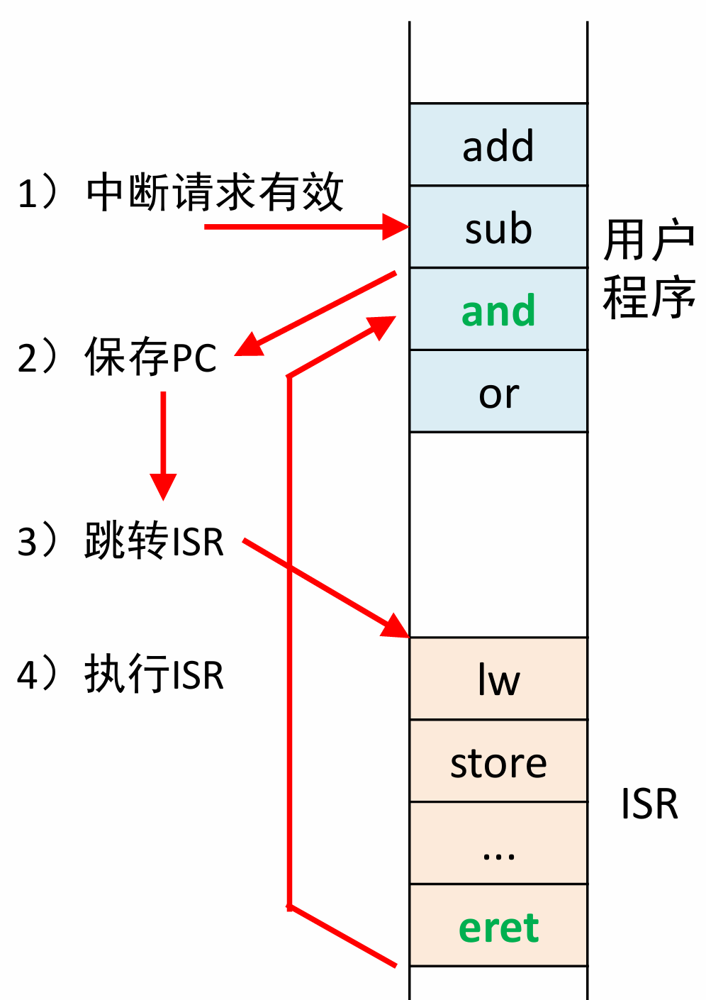
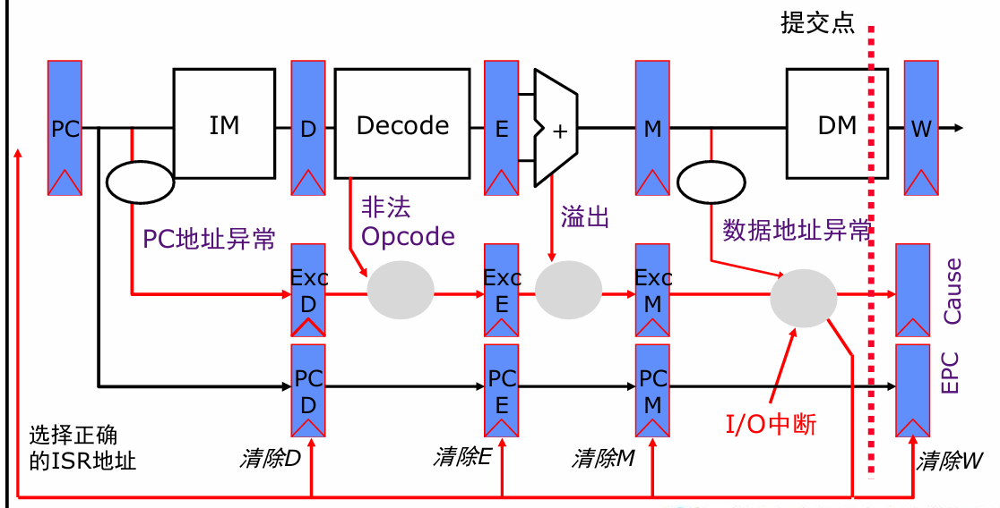
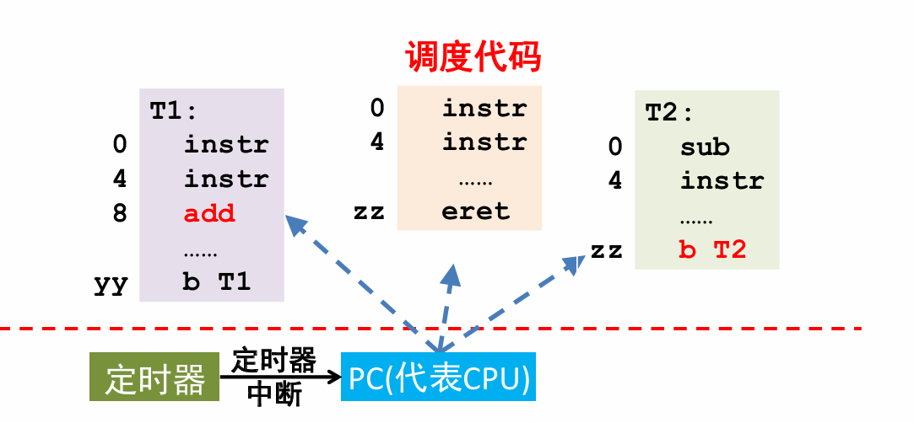

# 异常与中断

## 程序查询I/O

问题背景：访问设备，设备给反馈有延迟

### 设备寄存器

+ **状态寄存器**：至少包含是否就绪的**Ready位**， 表示是否可以输入输出（数据是否有效）

+ 数据寄存器

### 程序查询I/O的原理

回顾：**掩码**：抹掉无关位，只提取出对应位

+ 只需要在需要的位置处设0，其他无关位设1，将对应信息**与**上它。

1. CPU循环读取status寄存器，直到Ready置位(0->1)

2. CPU用load指令/store指令，读/写Data寄存器

   1. 设备译码并执行完CPU操作后，会复位Ready位。(1->0)

   + 对于写操作而言，0意味着当前满，1意味着清空可以写入

#### 缓冲：FIFO（队列）/Buffer

1. 当 FIFO 的**当前可用空闲长度**（剩余空单元数）≥待写入数据长度时，具备一次性写入的容量基础
2. 当 CPU 通过**查询设备状态寄存器**（FIFO 可写入标志位有效）或**接收 FIFO 就绪中断**，获知 FIFO 处于可写入（ready）状态时，可将数据一次性写入 FIFO/buffer 中
3. 该操作的核心优势是：减少 CPU 等待设备内部核心部件逐次处理数据的写等待开销（无需逐字 / 逐字节写入设备内部寄存器并等待单条数据的处理确认），仅需**等待一次批量数据写入 FIFO 的完成信号**，提升 CPU 与设备的数据交互效率

### 非计划型的过程-异常中断

+ 问题背景：CPU的主频是1GHz，而I/O设备 带宽从0.01KB/s到125,000KB/s，差异太大，而且人机交互还需要等待人的收入

**类比小学奥数：合理安排时间的问题，减少空等，先开水，然后切菜等待水开**

1. 当设备就绪后，设备向CPU发出信号（任意时候）
2. CPU收到信号，先执行完当前指令，然后**自动执行预先设置好的过程** **【陷入内核】**
3. 该特定过程执行完后，再回到原先现场


>  **拓展：命令式编程 / 事件型编程，前者类似于C语言，后者就是中断异常**  --- **Game dev Logic**


## 中断与异常

### 中断 Interrupt

1. 由**I/O设备**产生的**异步事件**
2. **中断处理**：cpu执行一段被称为中断服务程序（interrupt service  routine，ISR）来处理设备请求

### 异常 Exception

1. 由于**cpu执行指令**而产生的**同步事件**

2. 产生原因：出现了不期望的状态，例如除以0， 溢出，TLB缺失。
3. **异常处理**：cpu停止继续执行当前指令，类似中断处理一样转入特定的异常处理程序

+ 注意：**与函数调用不同**

### 中断异常的不同

1. 中断：异步；异常：同步
2. **受害指令**： **宏观PC的**发生中断异常的指令
   - 中断：执行完当前受害指令
   - 异常：停止执行当前受害指令，直接转入异常处理程序
3. **PC保存**
   - 中断：将当前指令的下一条指令保存到EPC（Exception Program Counter）中
   - 异常：将下一条指令保存到EPC中

和jal的不同，jal要去的地址是计算出来的 PC31-28 || imm26 || 00

### 中断处理的基本过程



+ eret(Exeption return): PC <- EPC  EXL <- 0;

### CP0-硬件机制

#### 功能

1. **保存EPC**
2. 固定首条ISR指令地址（异常/中断处理程序入口地址）


#### CP0的构造-四个寄存器

#### EPC寄存器

1. 保存中断/异常时的PC

#### Cause寄存器

+ IP[7:2] 6个中断位，分别对应6个外部中断

+  ExcCode[6:2] 异常编码

  | ExcCode | 助记符 | 描述 |
  | --- | --- | --- |
  | **0** | **Int** | **外部中断**。来自外部设备。 |
  | **4** | **AdEL** | **取数或取指时地址错误**。通常是地址不对齐或越界。 |
  | **5** | **AdES** | **存数时地址错误**。通常是地址不对齐或试图写只读区域。 |
  | **8** | **Syscall** | **系统调用**。由 `syscall` 指令主动触发。 |
  | **10** | **RI** | **非法指令码**。译码阶段无法识别的指令。 |
  | **12** | **Ov** | **算术溢出**。自陷形式的整数运算指令（如 `add`, `addi`, `sub`）导致。 |

#### SR寄存器

+ IM[7:2] 局部中断使能，6位中断屏蔽位，分别对应6个外部设备
  + 1-允许中断，2-禁止中断，**起到掩码，屏蔽某些外部设备的作用**
+ IE位，**全局中断使能**
+ **非常重要**：**EXL：异常级**(Exception Level) 
  + 1-目前在异常中，不允许再中断，0-允许中断
  + 确保先把异常程序执行完。

## CPU支持异常

### 数据通路



+ **EPC的返回值**：**M级指令的地址**（M级是刚好未执行的那条指令，即为`受害指令PC+4`)

### B类指令的执行

+ **问题：中断发生，而且D级有跳转指令执行，这时二者在NPC处冲突**

+ **解决方案：handler的地址优先级高于b类指令跳转，因为先要进入异常**

>  **所有冲突的解决都要服务于<u>程序员的逻辑</u>**

### 异常处理程序的跳转

**系统复位时输出：0xBFC0_0000 ；硬件中断时输出：0xBFC0_0400；其他异常时输出：0xBFC0_0380**

+ **问题：异常程序空间很短**

+ **方案：使用跳转指令跳到其他地方的主体范围**

  + 但是 J指令 `PC <- PC[31:28] || Imm26 || 00`PC高四位确定，因此只能在附近256M的数据跳转。
  + 4G - 2G - 1G - 512M - **256M**

  > 附：这里的G M都是指数量大小 后面不跟B，b （一般来说是B，表示一个地址指向1B的内容）

+ **选择`jr $3` 预先在$3中存入主体指令的地址。****

+ **好处在于，不用预先知道异常处理程序的大小，直接跳转即可**

### 中断服务程序IRS

1. 保存现场，将**所有寄存器**都保存在堆栈中  (!这是与函数的区别，所有寄存器均得保护)
   - 因为不知道什么时候会中断，因此也不知道使用了哪些寄存器，所以都得保护！
2. 中断处理
3. 恢复现场，从堆栈中恢复**所有寄存器**
4. 中断返回，`eret`

### 检测中断信号 IntReq

1. 条件：
   + 6个外部设备中断请求，至少有一个有效且未被屏蔽` |(HWInt[7:2] & IM[7:2]) `
   + 全局写使能SR的IE位有效
   + 目前未处于IRS程序中（`!EXL`)

### 中断异常响应机制

1. 当检测中断信号为真时：**保存，跳转，关中断**,
   + 中断时，需要停止任何寄存器的写入

````verilog
//cp0.v
`SR_EXL <= 1'b1;
`Cause_BD <= BD;
`Cause_ExcCode <= (~`SR_EXL) && `SR_IE && |(`SR_IM & HWInt)? 5'b00000 : ExcCode;
EPC <= (BD)?(PC - 32'h0000_0004) : PC; 
//npc.v
if(IntReq) begin
    NPC = `TRAPPED_ADDRESS;
end
````

2. 当出现eret指令时：同时恢复PC，而清除EXL **【注意，我的P7实现中似乎不是同时，到d级就PC写入epc，传到m级再清除EXL的】**


# 多任务响应机制



核心问题：**如图，CPU正在执行T1，当“定时器”发出中断信息后，就要切换任务到T2；再次中断，就要切换任务到T1。**

+ **如何设计？**

1. 如何加载PC？

设EPC1为T1当前指令地址，EPC2为T2当前指令地址；

T1->T2 

```assembly
EPC <- PC+4 #T1

MFC0 $1

分析EPC处于T1,T2（$1)

#假设处于T1

sw $1 , EPC1 #保存T1的当前指令

lw $1, EPC2 #加载T2的当前指令

MTC0 $1
```

+ 而且我们不仅要保存PC，还要保存所有寄存器，这统一称为**进程控制块**

<u>操作系统拓展：</u>

硬件为操作系统提供了：

1. 通过EPC来读取该进程CPU指令地址
2. 可以修改EPC，来达到返回想去的地方

这样方便操作系统进行任务调度【调度机制】

> 软硬件协同

