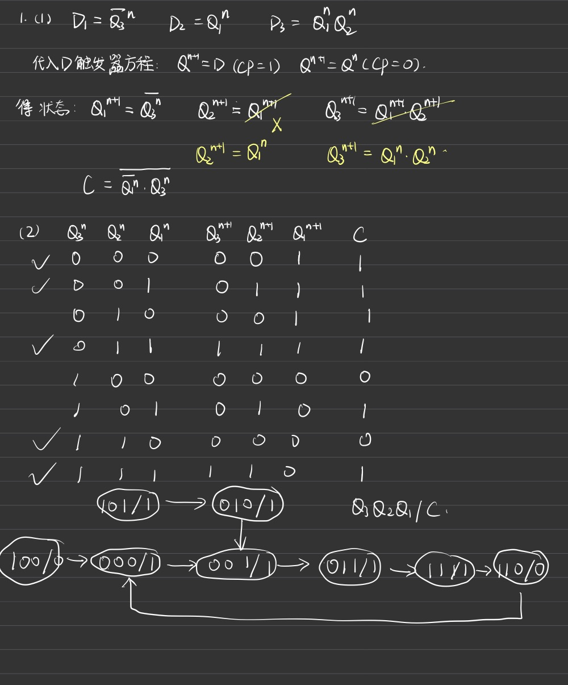
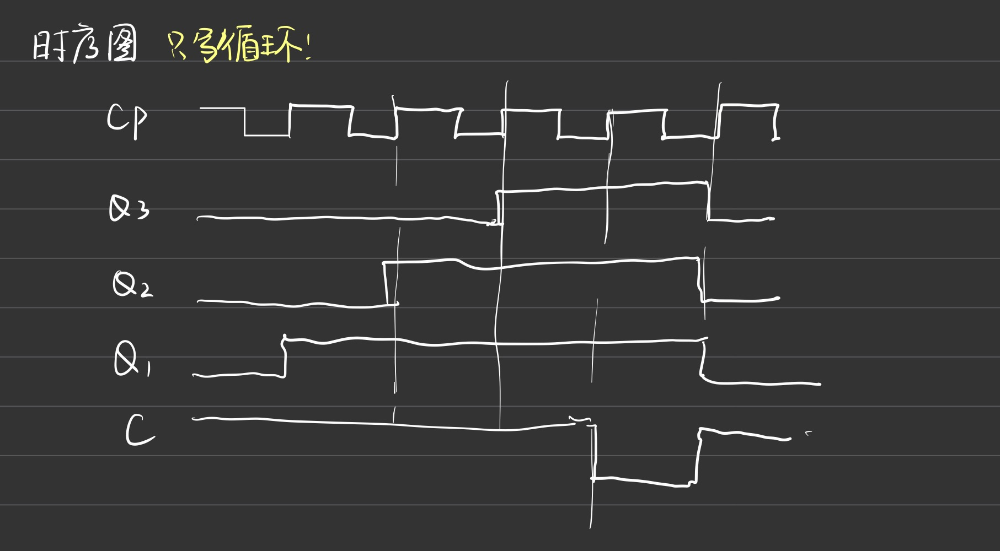
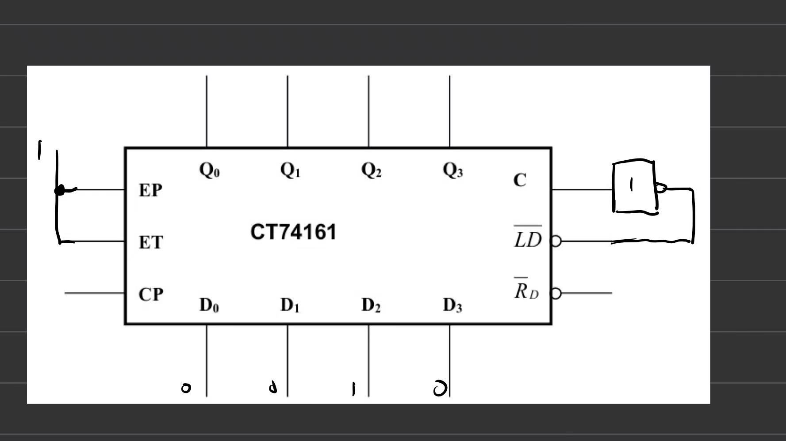
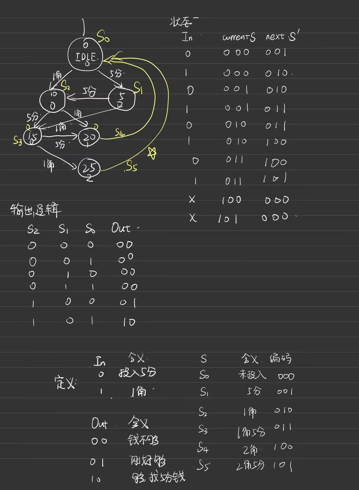

# 时序逻辑作业

刘哲晗 24371277

一、

1. 组合逻辑电路、储存电路

2. $$
   R_{D}S_{D} = 0
   $$

3. $$
   Q_{n+1} = J Q_{n} + \overline KQ_{n}
   $$

4. $$
    Q_{n+1} = D
    $$

5. 同步时序、异步时序
6. N
7. 反馈复位法、预置法
8. 100
9. 256
10. SR触发器、JK触发器、D触发器

二、

1. C
2. B 
3. B
4. D
5. C
6. A
7. D
8. B
9. B
10. A

三

**先看是何种触发器，再微调。**

脚标为n 目前状态

1、

（3）自启动功能的同步五进制加法计数器

2.

3.

状态转移逻辑函数表达式：
$$
\begin{align*} s_2' &= m_5 + m_6 + m_7 = \overline{s_2} s_1 \overline{s_0} I + \overline{s_2} s_1 s_0 \overline{I} + \overline{s_2} s_1 s_0 I \\ 
s_1' &= m_1 + m_2 + m_3 + m_4 = \overline{s_2} \overline{s_1} \overline{s_0} I + \overline{s_2} \overline{s_1} s_0 \overline{I} + \overline{s_2} \overline{s_1} s_0 I + \overline{s_2} s_1 \overline{s_0} \overline{I} \\ s_0' &= m_0 + m_3 + m_4 + m_7 = \overline{s_2} \overline{s_1} \overline{s_0} \overline{I} + \overline{s_2} \overline{s_1} s_0 I + \overline{s_2} s_1 \overline{s_0} \overline{I} + \overline{s_2} s_1 s_0 I \\ \end{align*}
$$
