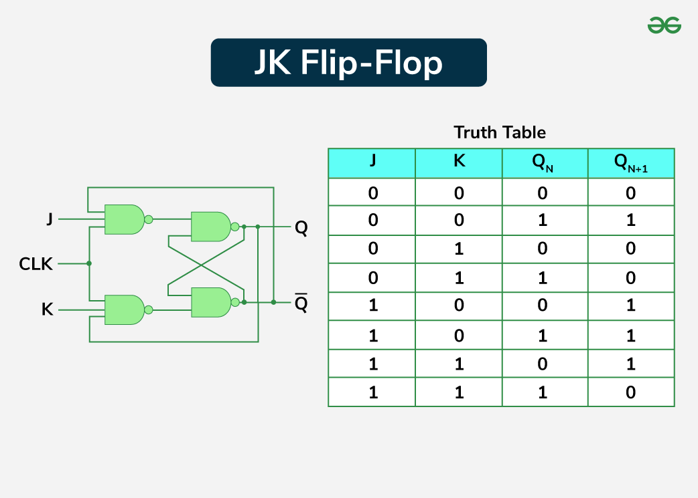

# 时序逻辑电路

参考资料：PPT [四种常见触发器（RS触发器、JK触发器、D触发器、T触发器）的基本逻辑及其状态 - asandstar - 博客园](https://www.cnblogs.com/asandstar/p/16942910.html)

术语： CP-Clock Pulse

**同步时序电路**：所有触发器的状态变化，都由**统一的时钟脉冲（CP）** 控制（通常在 CP 的上升沿或下降沿同步翻转），状态变化具有严格的时间一致性。

**异步时序电路**：没有统一的时钟脉冲，触发器的状态变化由**输入信号或前一级触发器的输出信号**直接触发，状态变化无固定的同步节奏。

## SR flip flop

+ 最简单的时序电路

+ S- Set R - Reset

+ **即时输入**：t时刻的输入

  **即时状态**：t时刻的输出

  **次态**：t时刻以后的输出

  -触发器次态不仅同即时输入有关，还与即时状态有关

+ **状态方程**：*Qn+1 = S + Qn · R'*   (描述触发器即时输入S、R，即时状态Qn和次态Qn+1间关系)

+ **激励表**：在已知**状态变化（初态→次态）**的情况下要求找出实现该状态变化的**输入条件**

## JK flip flop(时钟)

+ JK触发器与RS触发器对应逻辑功能：J对应S，K对应R，但**不同的是JK=11时状态翻转而SR=11禁止**
+ 状态方程与状态表

+ $$
  Q_{n+1} = J Q_{n} + \overline KQ_{n}
  $$

  

+ **时钟触发器**

+ J- set K- Reset
+ **激励表如下**

## D-flip flop D触发器

+ 制作数据寄存器的基础，又称主从寄存器（包含两个D锁存器）
+ 时钟上升沿时，将D复制到Q，其他时候保持不变。
+ 状态方程与表

$$
Q_{n+1} = D
$$

## 移位寄存器

+ 存储多位数据
+ 由N个触发器构成
+  存储容量：N
+ 特殊类型：移位寄存器
        ├── 数据可向左/右移动
        ├── 串行与并行模式
        └── 常用于延时、串并转换、序列发生器

## 计数器

**计数器模值（Modulus）**-总共可计的个数

- 固有模值：由计数器设计位数/类型决定（例如 n 位二进制计数器模值为 $2^n$）；
- 可改模手段：**异步清零（复位）**、**并行预置/并行装入**、以及用门控逻辑在达到特定计数时触发回绕（外部门控复位）。

**级联计数器**

- 多片低位计数器级联可扩展位数；三片 4 位 → 12 位 → 模值 $2^{12}=4096$。

**十进制计数器**
      ├── 每4位构成1个十进制位（模10）
      ├── 若有n个十进制位 → 模10^n
      └── 例：8级（2位十进制）→ 模100