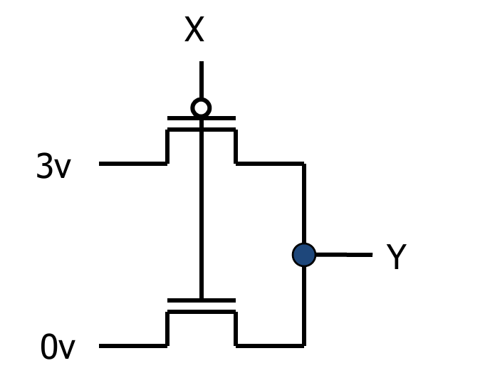

# 从晶体管到逻辑门

## CMOS Transistor networks

+ MOS : Metal-Oxide on Semiconductor（金属氧化物半导体）

+ C： complementary，一对关闭或者打开的**开关**

+ N型（高电平打开，低电平关闭）、p型（高电平关闭，低电平打开)  

+ 电路规则

  + 导通时应该让 source电压与 gate电压有反差，例如：N-晶体管，传递0的信号更强，传递1更弱（V_dd - V_th)
  + 避免无源驱动，需要有Vdd或者地面
  + 避免短路

+ **逻辑门的本质**： 

  + **开态** ：输出晶体管导通，源极和漏极连通
  + **关态** ： 输出晶体管截止，源极和漏极阻断
  + 通过P型、N型晶体管的组合开与关，来控制输出电压
  + 以**非门**为例：

  