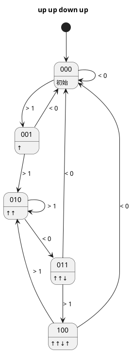

# P0 课上

## P0_ups_and_downs
+ 思考：用比较器 选择、复用器等器件实现：a>b 输出2 a=b 输出1 a<b 输出0
  + 将大于判断 等于判断用splitter 分别拉到输出Y1 Y0上即可

```plantuml
@startuml
title up up down up

[*] --> 000
000 --> 001 : > 1
000 --> 000 : < 0
001 --> 010 : > 1
001 --> 000 : < 0
010 --> 010 : > 1
010 --> 011 : < 0
011 --> 100 : > 1
011 --> 000 : < 0

100 --> 010 : > 1
100 --> 000 : < 0

000 : 初始
001 : ↑
010 : ↑↑
011 : ↑↑↓
100 : ↑↑↓↑
@enduml
```