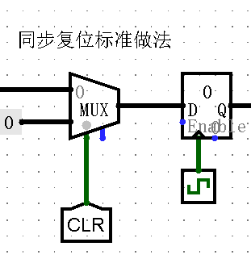
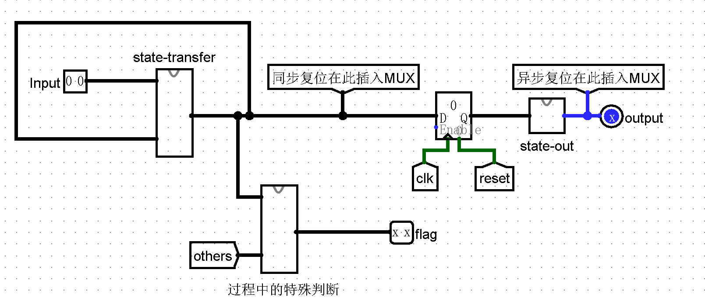
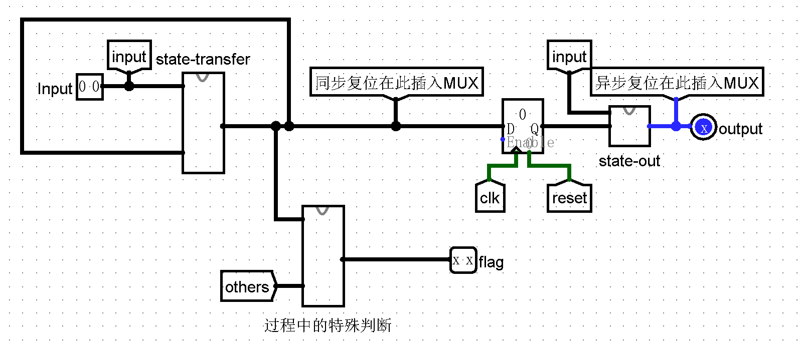
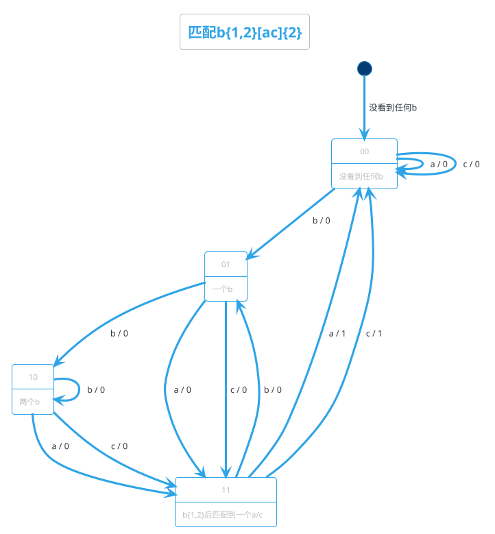
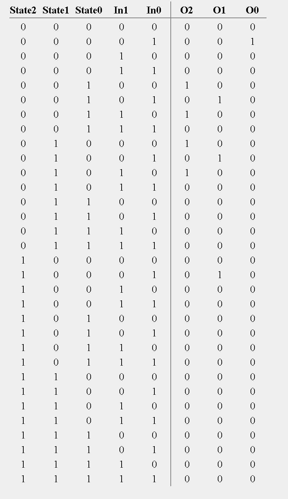

# P0-logisim的应用

## IF语句

+ **用MUX 数据选择器**实现
+ **选择数据长度**：可选项总数的数据位宽
+ **数据位宽：** 输入的数据位宽
+ **下端左侧：**选择数据
+ **下端右侧：** 使能端

## 应用1-GRF

+ 选择地址写入数据 -- DMX（Demultiplexer）:将一个数据分配给某一个
+ 选择地址读取数据 -- MUX（Multiplexer）

+ **重点**，如果DMX Three state勾选为yes，那么DMX输出端没有被选中的路径会保持原来的值不变，在此题中必须勾选为yes1

## 关于自动化

**最小化最小单元**

建议：

+ 先搭建一个重复单元
+ 然后根据XML文件中对应器件的模块，输入到脚本中复制
+ 

## 关于状态机的复位

+ **同步复位的标准实现**：MUX 与 复位值进行选择

  

+ **异步复位的视线实现**： 输出处进行逻辑组合，并连接Reg的复位端

  ​	
## 两种状态机的模型
**Moore**

当转移到下一个状态之后，才判断输出
往往需要更多的状态

**Mealy**


当状态转移时，判断输出
可以节约一些状态


## Mealy状态机的设计

正则表达式是对字符串操作的一种逻辑公式，它通常被用来检索、替换符合某个模式的文本。

它的规则比较复杂，我们现在只讲解其中比较简单的几种规则。

[...]是指要匹配中括号中的字符(注意是字符不是字符串),比如[xyz]就是要匹配x y z这三个字符中的任意一个。 

{...}是指要求匹配”{“前的那个字符几次，比如a{2}是指要匹配a两次，a{2,4}是指要匹配a 2至4次,a{,4}指要匹配a 0至4次，a{2,}指要匹配a 2至无穷次。所以[cd]{1,2}就是要求匹配(c或d)一次或两次,即ccs、dd、cd、dc、c、d都是能匹配的。

 (...)是指将()内的字符串视为一个整体，比如(ab){1,2}对应的就是ab或abab。 

我们也可以将多条表达式组合起来，如a{2}b{2}就是指匹配a两次后再匹配b两次,即匹配aabb。

提交要求 使用Logisim搭建一个Mealy型有限状态机 检测串行输入字符串中的能匹配正则表达式b{1,2}[ac]{2}的子串并输出。
### 状态转移
1. 定状态：
    + 写出要匹配的目标模式（如 b{1,2}[ac]{2}）。

    + 列出所有可能的状态（包括部分匹配的情况）
      + "没有任何前缀匹配"
      + b bb 
      + ba bc bac bca baa bcc
      + bba bbc bbac bbca bbaa bbcc

    + 对每个前缀，问自己：“接下来输入什么会改变它的状态？”

    + 发现：有的前缀可以合并，有的必须独立，于是得到了状态数量。
      + 在mealy机中，由于输出与当时输入有关，如bbac等能够匹配的状态可以直接省略，转移到"没有任何前缀匹配"的状态

2. 画出状态转移图，定下来编码
再用箭头画出这些状态间的关系，就是状态图。


+ 或者 我们可以用独热编码，但需要注意**要为全为0留一个位置**哦！（否则初始化为1的电路很麻烦）
例如：
```
000 : 没看到任何b
001 : 一个b
010 : 两个b
100 : b{1,2}后匹配到一个a/c

00 : a
01 : b
10 : c
```
3. 列出 状态/输入/输出/下一状态的真值表
+ **tips: 直接在logisim里分析电路中填写真值表，会为你自动生成组合电路！这样我们可以快速搭建状态转移电路**
+ **当然 独热编码的布尔表达式往往比较简单，也可以自己推**
+ 