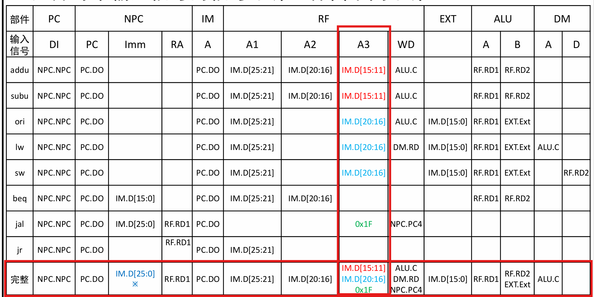

# 单周期CPU 形式建模 综合方法
**几个模块：**
1. IFU：取指令单元
2. GRF：通用寄存器组
3. ALU：算术逻辑单元
4. DM：数据存储器
5. EXT：扩展单元
6. Controller：控制器
   
## **设计思路：**

1. 构造功能部件：功能、接口、信号，高内聚，利用HDL语言描述
2. 构造指令级别的数据通路与控制信号取值，根据RTL语言描述
3. 综合数据通路，把分立的数据通路模块合成为一个整体数据通路
4. 综合控制器，合成所有控制信号取值为控制信号矩阵
5. 翻译实现：生成工程文件

**优点：**

+ 相较于增量式开发，在设计各个模块时，不需要关心各个模块的关系，只需要关注模块本身的功能和接口，最后再综合
+ 设计思路清晰，模块化设计，易于调试和维护，尤其是在指令数量较多时，优势明显。

## 建模的基本表示方式
+ **数据通路**
本质上就是**连接关系的集合**
+示例：3个部件的连接关系，表格

|部件| A | B | C |
|---|---|---|---|
|输入信号|A1|B1|C1|
|输出信号|A2|B2|C2|

+ **建模的推理：倒推法**
倒推推理过程-环节步骤表

| 环节 | 步骤   | 语义                                   | 连接关系                          | 功能部件 | 控制信号取值 |
|------|--------|----------------------------------------|-----------------------------------|----------|--------------|
| -1    | 回写   | 计算结果回写至rd寄存器                 | <ALU.C,RF.WD> <IM.D[15:11],RF.A3> | RF       | RFWr:1       |
| -2    | 执行   | ALU执行加法                            | <RF.RD1,ALU.A> <RF.RD2,ALU.B>   | ALU      | ALUOp:ADD    |
| -3    | 读操作数 |                                        | <IM.D[25:21],RF.A1> <IM.D[20:16],RF.A2> | RF       |              |
| -4    | 读指令 | 读取指令 计算下条指令地址 更新PC | <PC.DO,IM.A> <PC.DO,NPC.PC> <NPC.NPC,PC.DI> | IM PC NPC |              |

+ 控制信号：为了执行，需要有什么样的控制信号！

| 指令 | NPC  | PC      | IM    | RF          | RF          | RF          | RF  | ALU    | ALU    | DM  | DM  |
|------|------|---------|-------|-------------|-------------|-------------|-----|--------|--------|-----|-----|
|      | PC   | DI      | A     | A1          | A2          | A3          | WD  | A      | B      | A   | WD  |
| addu | PC.DO | NPC.NPC | PC.DO | IM.D[25:21] | IM.D[20:16] | IM.D[15:11] | ALU.C | RF.RD1 | RF.RD2 |     |     |

## 新指令的加入- jal jr

### jal: jump and link
RTL描述：`PC <- {PC+4[31:28], instr_index, 2'b00}; RF[31] <- PC+4`

### jr: jump register
RTL描述：`PC <- RF[rs]`
+ 方案：1. 经过NPC中转 2. 直接连接到PC
    + 根据**最小知识原则**，选择经过NPC中转，确保NPC是**唯一知道如何计算PC值的模块**
+ 建模时发现，对于同一个部件NPC，读指令需要PC+4，而计算返回地址需要读取ra地址
  + 由于同一周期内，后发生的事件会覆盖前面的（PC的寄存器还没有被覆盖），所以最终读到的值是ra地址

## 数据通路综合方法

**1. 汇聚：** 将独立建模的指令级别数据汇集在一起。

**2. 综合：**归并每个输入信号（端口）的信号来源，**保留不同来源**，不同来源到**同一输入的自动综合为MUX**

**3. 建模：从设计模型到Verilog HDL**

**以ALU的B端口为例：**

| 项目\部件 | PC    | NPC       | NPC       | NPC       | IM        | RF         | RF         | RF         | RF         | RF         | EXT        | ALU        | ALU        | DM     |
|-----------|-------|-----------|-----------|-----------|-----------|------------|------------|------------|------------|------------|------------|------------|------------|--------|
| 输入信号  | DI    | PC        | Imm       | RA        | A         | A1         | A2         | A3         | WD         | Imm        | A          | B          | A          |        |
| 完整信号  | NPC.NPC | PC.DO     | IM.D[25:0] | RF.RD1    | PC.DO     | IM.D[25:21] | IM.D[20:16] | IM.D[15:11] 0x1F | ALU.C DM.RD NPC.PC4 | IM.D[15:0] | RF.RD1    | RF.RD2 EXT.Ext | ALU.C      |

**Verilog HDL代码片段：**
- **Wire定义**：
  - `wire [31:0] RD2 ;`
  - `wire [31:0] Ext ;`
  - `wire [31:0] ALU_B ;`

- **模块实例化**：
  - 寄存器堆（RF）：`RF U_RF( ..., RD2, ... ) ; // 实例化寄存器堆`
  - 扩展单元（EXT）：`EXT U_EXT( ..., Ext, ... ) ; // 实例化扩展单元`
  - 算术逻辑单元（ALU）：`ALU U_ALU( ..., ALU_B, ... ) ; // 实例化ALU`
  - 二选一多路选择器（MUX32_2_1）：`MUX32_2_1 U_MUX_ALUB( RD2, Ext, ALU_B, ALUBSrc ) ; // 实例化`

