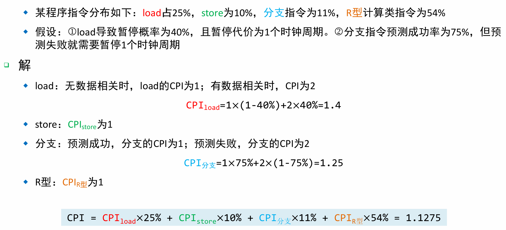
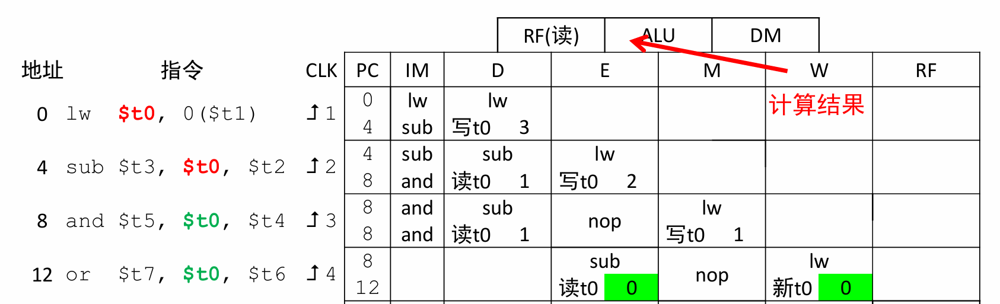
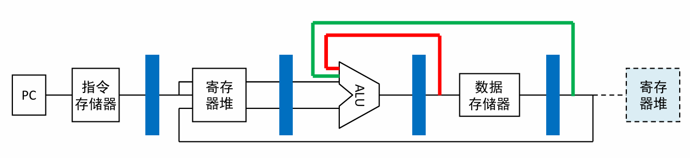
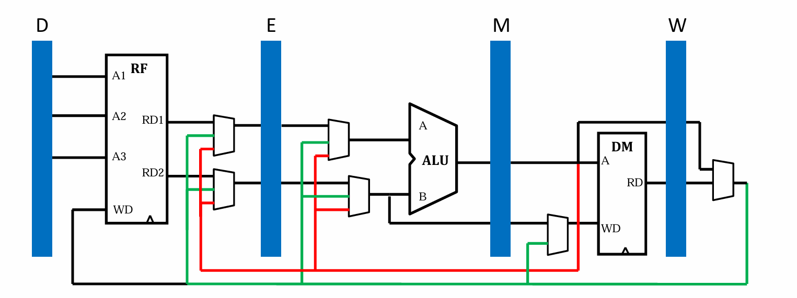
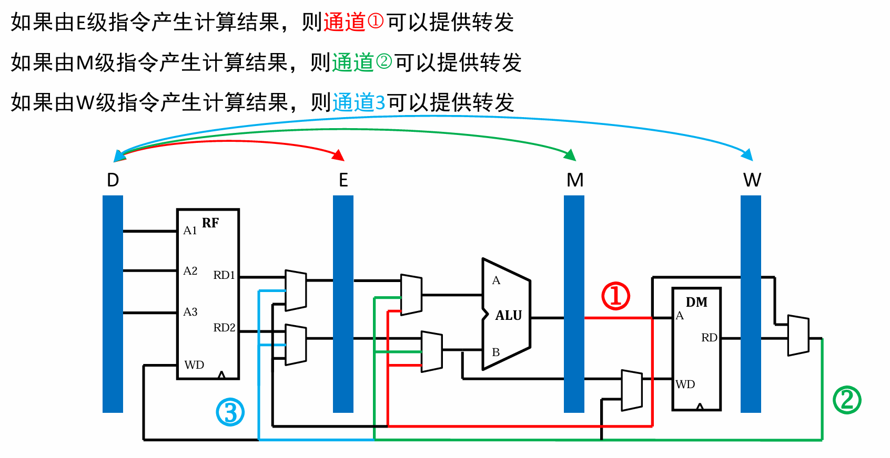
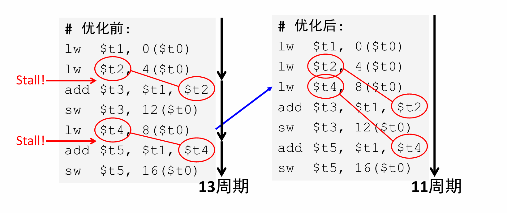
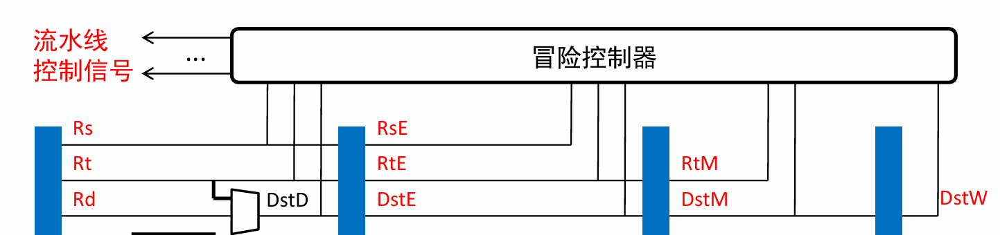
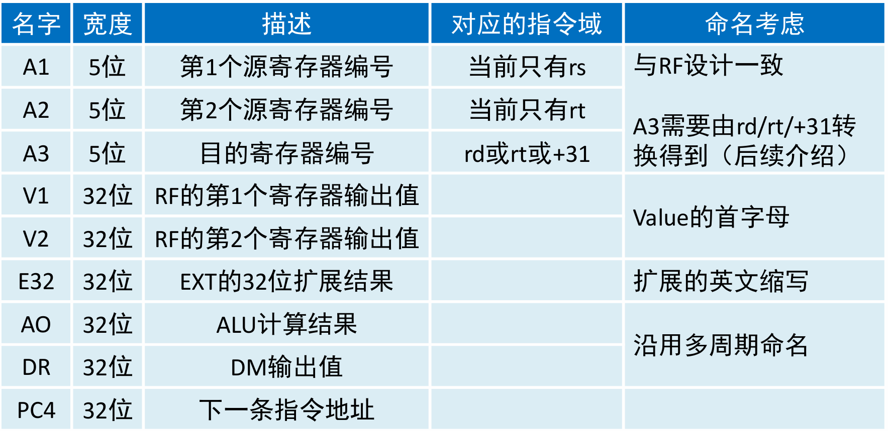

# 时钟频率
## 术语
+ 建立时间：输入信号在时钟上升沿之前必须有效的时间 
+ 保持时间：输入信号在时钟上升沿之后必须保持有效的时间
  + 
+ 输出延迟：输出信号在时钟上升沿输出有效值的时间。

+ 最大频率：取决于关键路径的最大延迟越小
   + 最大延迟 = 建立时间 + 输出延迟 + 组合逻辑延迟
  

## 单周期的性能
+ **关键路径**：任意**两个寄存器之间的最大延迟**
  
  + **电路中的时间周期：大于关键路径**， 否则无法正常传递数据。
+  最大频率，由路径最长的指令决定，即为**lw指令**

+  **单周期的局限性：最大频率取决于延迟最长的指令**
    - 切成若干份，降低延迟。

# 流水线电路
+ **我们能不能在每一个环节之间都加入一个寄存器？**

## 实例：简单的流水线电路

+ 从左向右，依次推演
+ 如果把`100` `200` `300`依次当成一个指令，那么就会**交错执行，提升效率**

## 流水线的形式表

**我们在流水线中，关心的是指令之间的关系**，而非关心组合逻辑。

+ 左侧表示第几个上升沿
+ 水平方向表示流水线执行布局
+ 竖直方向表示每一个寄存器在相应时钟上升沿后的值

## 流水线性能

+ 均衡性，因为**总体频率取决于最慢的段**。
+ 对于大部分指令，完成周期均为N （N为流水线级数） 
+ **流水线充满**：一组指令序列全部进入之后，**一个时钟周期就可以完成一条指令**

### 性能比较

单周期：

 

流水线

+ 比较1：单条周期没有加速（反而会变长），因为需要按照**各段最慢的时间**来定义周期
+ 比较2：流水线改善的是**吞吐率**：**整体多条指令会变快**

### **流水线加速比**

+ 理想加速比（完全均分） = 流水线级数
+ 如果各个流水线执行时间不均，降低加速比
+ **填充和排放流水线**，会降低加速比
+ BEQ / JAL / J，会改变指令顺序，中断流水线，

### **流水线CPI**
+ CPI: cycles per instruction
+ 理想情况下，每个周期完成一个指令 $$CPI = 1$$
+ 实际上，$$CPI > 1$$
  **建模计算**：期望（加权平均）
  

### 指令级并行（ILP）

Instruction level Parallelism

**单核CPU**

+ 单条流水线
+ **超标量**多条流水线：共用同一个寄存器堆

**多核CPU**

+ **任务级并行**

### MIPS指令集与流水线效率

+ 指令定长，都是32位
+ 指令格式少，格式规整，两个源寄存器（rs,rt）位置保持不变（control 和 读寄存器并行)
+ 存储器操作只有 load/store，访存的周期数固定（1个周期）
+ 面向流水线的设计。

# 流水线规范

## 功能分区与寄存器命名

**用各级后面的功能的某个字母命名**

+ 信号命名：**信号__对应寄存器**
+ **IF**：Instruction Fetch（取指令）
+ **ID**：Instruction Decode（指令译码）
+ **EX**：Execute（执行）
+ **MEM**：Memory Access（访存）
+ **WB**：Write Back（回写）

### 

## 流水线时空图

**指令 + 周期 + 寄存器**

---

# 流水线数据通路

## Q1: D级能否读出W级写入RF的值？

+ **多条指令同时读写同一个寄存器时，会产生一致性问题**
+ 出错原因： **后发Read操作，在先发Write操作之前完成**
+ 解决方案：**转发**

## Q2 信息同步

+ 例子：多条连续指令用到了三种NPC的信息，同时进入NPC中

+ **出错原因：**指令的多个相关信息没有**同步传递**，需要在执行时，再传入NPC中

  

+ **流水线的控制信号：也必须要同步传递**

# 冒险
**生产与消费的同步**

## 结构冒险

**征用同一个资源**

+ **取指令与访存**(IM cache/DM cache**)要分开**，否则会产生资源冲突
+ **RF 读数据与写数据要分开**， 读端口与写端口要分开，否则也会冲突
**已经在单周期内解决了!**

## 数据冒险

**指令之间的数据依赖，例如前面的Q1**

### 基于寄存器的数据相关
+ **想法** 写是一个比较有****破坏性**的操作
对于同一个寄存器来说，有**W-W  R-W  W-R**三种读写组合会残生冲突

+ **原则：** 程序员的逻辑，后续指令需要获得之前指令的结果
+ 实例：`add $1, $2, $3` `sub $4, $1, $2`后一个sub需要用到add的结果`$1`
  
### 其他指令
- 

### load 导致的数据冒险
`lw`指令产生结果太晚，在W级才可以得到
+ 因此需要先暂停一拍（`nop`指令）。
  

### **旁路 bypast** **转发 forward**
**将M、W级保存的计算结果向前级E级的ALU传递。**
  + 当E级指令与M级指令写的**寄存器是同一个**时，则选择转发的结果，否则是E级传递的寄存器值
**例子：**
- M-E转发：`add $1, $2, $3 sub $4, $1, $6`
- W-E转发: ` add $1, $2, $3  XXX  or $5, $1, $2`
  

1. 最新结果： 可能产生在**M级和W级**
2. 需要使用结果： 可能产生在 **D,E,M**级
    
3. **最终策略：**
   - D级：分析与E/M/W的相关性。若转发无法解决则暂停，直至转发可以解决相关
   - E级：无暂停问题，只需要分析与M/W的相关性，决定是否转发即可
   - M级：无暂停问题，只需要分析与W的相关性，决定是否转发即可  

### **D级：加载延迟槽**

D级大门，要有一个看大门的，一旦之前指令有冲突，就需要暂停。

  1. 计算类指令：
  2. 暂停类指令：LW
      - 条件1：D级的指令要读取RS寄存器
      - 条件2：E级为load类指令
      - 条件3：D级读取的寄存器和E级写的寄存器相同
      - `Stall = (add + sub + … + lw) & lwE & (A1==A3E)`
  3. 暂停操作
      - 冻结D级：使能信号为0
      - 清除E级：clr = 1
      - 禁止PC计数：使能信号为0

### 编译优化【编译原理】
+ **将与load无关的指令放置在load类指令后**

## 控制冒险
**产生原因：分支指令影响控制流**

  - 当**分支指令结果出现**前，D级取指令无法确保指令是正确的！
- 方案1：直接暂停，会大大降低效率
- 方案2：假设不进入分支，若Zero为1，再清除前两条指令(D,E)
  - **方案3：BEQ判断前置：因此使用数据提前了**
  - 和计算类指令的冲突：
  - 和lw指令的冲突；
- 方案4：分支延迟槽

## **冒险控制器**
**检测分析各类冒险，控制流水线的运行**
+ 传入每一级的数据

# 流水线工程方法

**全速流水线：**

1. 构造无转发的**基础流水线**：插入几级寄存器
2. 构造**转发电路**
   1. 对于每一个**功能部件**，询问它是否需要用到**寄存器的值**，**谁在功能部件后，谁就要连过来**
   2. 需要注意D级判断Zero的也是一个功能部件！
3. 添加**暂停（延迟槽）**：利用生产消费模型
4. 构造暂停/转发**策略矩阵**，根据矩阵生成暂停和转发控制表达式

## 生产消费模型

**对于一条指令来说，需要考虑**

**时间1：**什么时候<u>用到</u>寄存器的值？【消费】$T_{use}$

**时间2：**什么时候产生寄存器的值？【生产】$T_{new}$

例如： `lw $1, 0($0)`  要到W级才可产生。

**分析暂停条件：** $T_{use}< T_{new}$ 

## 流水线命名

**例如：rt就有二义性，可能代表源寄存器编号，也可能是写寄存器编号**

**为消除歧义，对指令字段进行重命名：**

+ RS → A1（源操作数1编号）

+ RT → A2（源操作数2编号）或 A3（目的操作数编号）

+ 对流水线中传递的值统一命名，如V1（A1对应寄存器值）、V2（A2对应寄存器值）、AO（ALU输出）、DR（数据存储器读出值）、PC+4等，确保跨级传递的一致性。

## 流水线数据通路

注：

1. RF：将读写分离，便于理解第五阶段。

**寄存器的功能：** 

1. **保存前一级功能部件产生的信息** **【所以关注信息产生的来源】**
2. 传递信息，一路向下传即可

## LW指令

|  步骤  |                             RTL                              |  控制信号   |
| :----: | :----------------------------------------------------------: | :---------: |
|  回写  |                      `RF[A3@W] <- DR@W`                      |   RFWr: 1   |
|  访存  |               `DR@W <- DM[AO@M]  A3@W <- A3@M`               |             |
|  计算  |            `AO@M<- ALU(V1@E,E32@E)  A3@M <- A3@E`            |  ALUOp:ADD  |
|  读数  | `V1@E<-RF[IR[rs]@D]; E32@E<-EXT(IR[i16]@D); A3@E<-IR[rt]@D; A1@E<-IR[rs]@D` | EXTOp: Sign |
| 读指令 |                `IR@D <- IM[PC]; PC <- PC + 4`                |             |

## 转发设计

+ 生产消费模型

**在消费者处增加转发MUX**

1. 转发MUX的路数等于N+1  N：后级转发数据的数量，1：前级传递寄存器数据
2. 建议规划转发MUX端口时，端口**数字越大则其优先级越高**(选择语句中靠前)

3. 命名：
4. 