# 时钟频率
## 术语
+ 建立时间：输入信号在时钟上升沿之前必须有效的时间 
+ 保持时间：输入信号在时钟上升沿之后必须保持有效的时间
  + 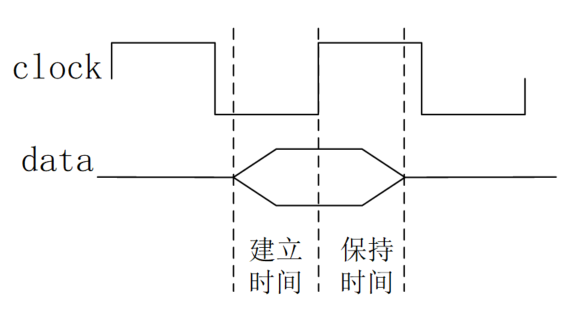
+ 输出延迟：输出信号在时钟上升沿输出有效值的时间。

+ 最大频率：取决于关键路径的最大延迟越小
   + 最大延迟 = 建立时间 + 输出延迟 + 组合逻辑延迟
  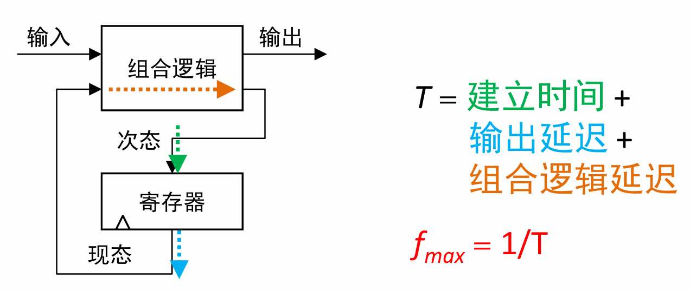

## 单周期的性能
+ **关键路径**：任意**两个寄存器之间的最大延迟**
  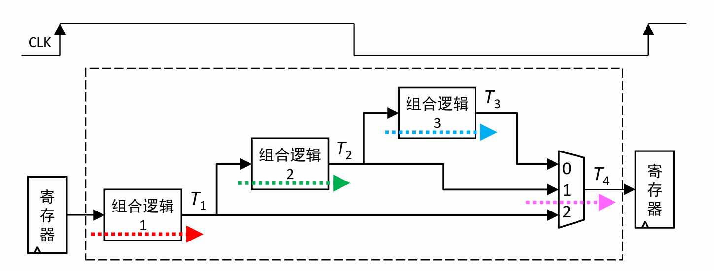
  + **电路中的时间周期：大于关键路径**， 否则无法正常传递数据。
+  最大频率，由路径最长的指令决定，即为**lw指令**

+  **单周期的局限性：最大频率取决于延迟最长的指令**
    - 切成若干份，降低延迟。

# 流水线电路
+ **我们能不能在每一个环节之间都加入一个寄存器？**

## 实例：简单的流水线电路
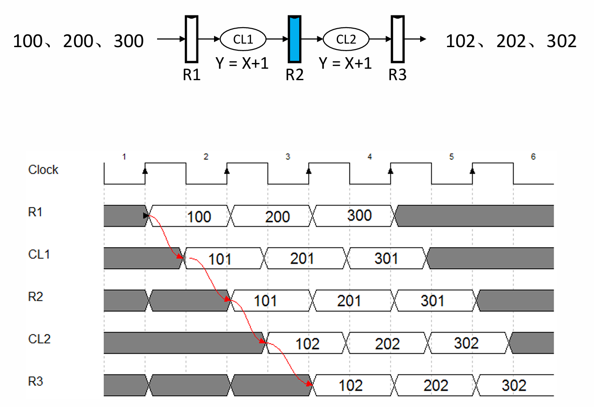

+ 从左向右，依次推演
+ 如果把`100` `200` `300`依次当成一个指令，那么就会**交错执行，提升效率**

## 流水线的形式表
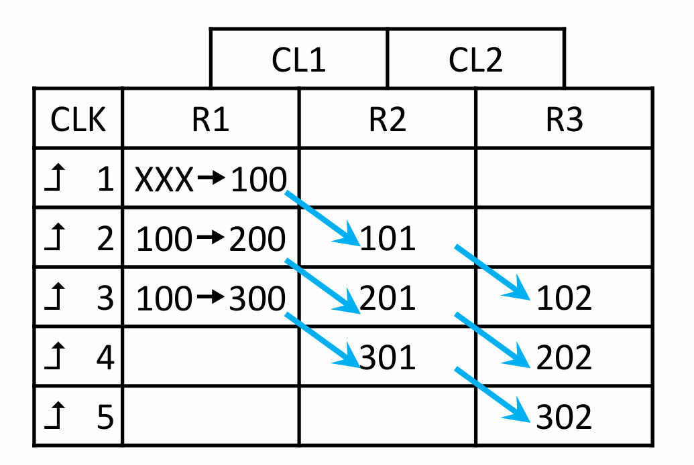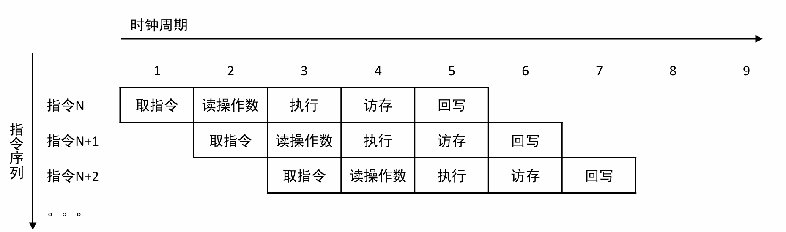
**我们在流水线中，关心的是指令之间的关系**，而非关心组合逻辑。

+ 左侧表示第几个上升沿
+ 水平方向表示流水线执行布局
+ 竖直方向表示每一个寄存器在相应时钟上升沿后的值

## 流水线性能
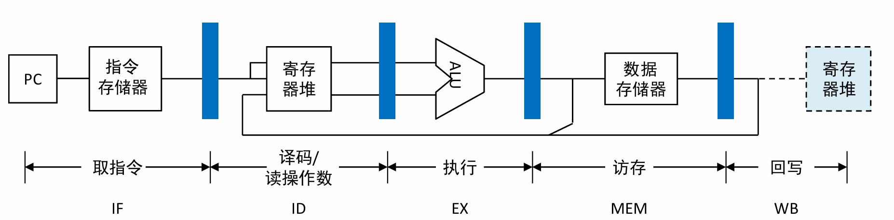

+ 均衡性，因为**总体频率取决于最慢的段**。
+ 对于大部分指令，完成周期均为N （N为流水线级数） 
+ **流水线充满**：一组指令序列全部进入之后，**一个时钟周期就可以完成一条指令**

### 性能比较

单周期：

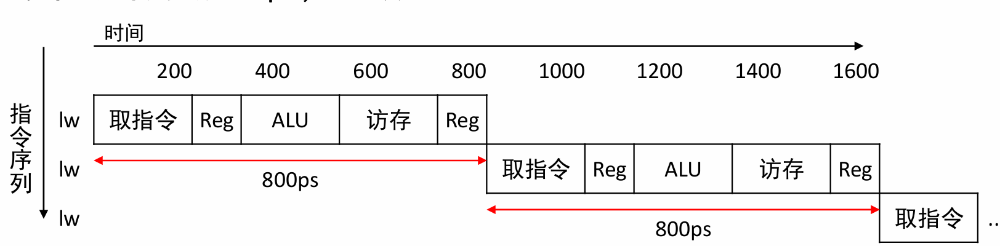 

流水线

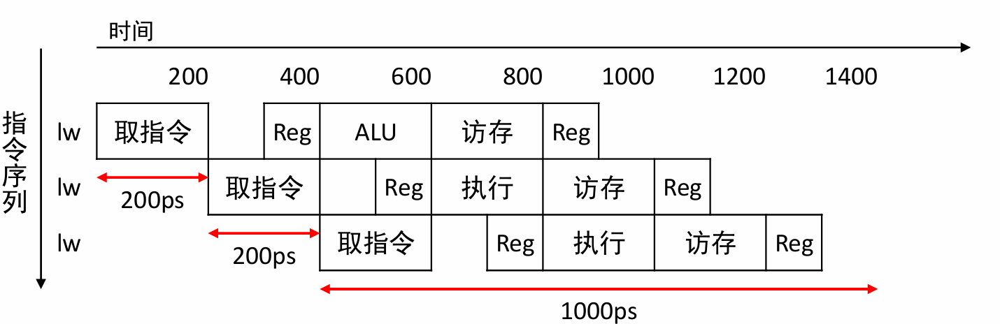

+ 比较1：单条周期没有加速（反而会变长），因为需要按照**各段最慢的时间**来定义周期
+ 比较2：流水线改善的是**吞吐率**：**整体多条指令会变快**

### **流水线加速比**

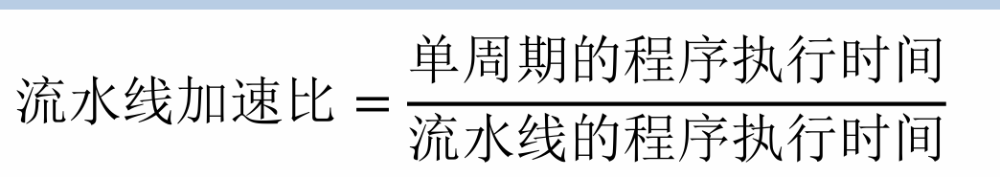

+ 理想加速比（完全均分） = 流水线级数
+ 如果各个流水线执行时间不均，降低加速比
+ **填充和排放流水线**，会降低加速比
+ BEQ / JAL / J，会改变指令顺序，中断流水线，

### 指令级并行（ILP）

Instruction level Parallelism

**单核CPU**

+ 单条流水线
+ **超标量**多条流水线：共用同一个寄存器堆

**多核CPU**

+ **任务级并行**

### MIPS指令集与流水线效率

+ 指令定长，都是32位
+ 指令格式少，格式规整，两个源寄存器（rs,rt）位置保持不变（control 和 读寄存器并行)
+ 存储器操作只有 load/store，访存的周期数固定（1个周期）
+ 面向流水线的设计。

# 流水线规范

## 功能分区与寄存器命名

**用各级后面的功能的某个字母命名**

+ 信号命名：**信号__对应寄存器**
+ **IF**：Instruction Fetch（取指令）
+ **ID**：Instruction Decode（指令译码）
+ **EX**：Execute（执行）
+ **MEM**：Memory Access（访存）
+ **WB**：Write Back（回写）

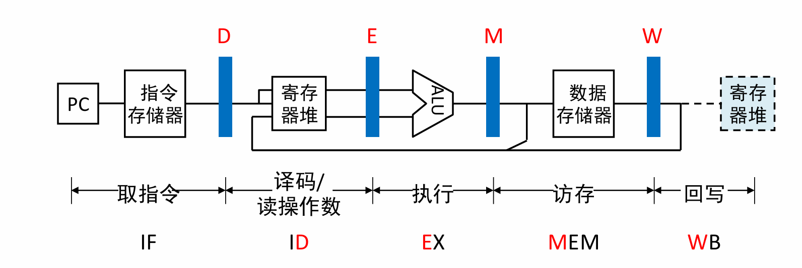

### 

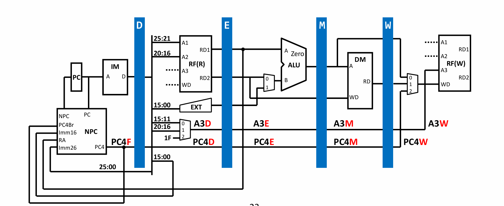

## 流水线时空图

**指令 + 周期 + 寄存器**

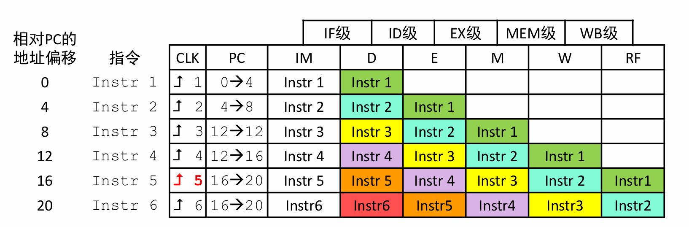

# 流水线数据通路

## Q1: D级能否读出W级写入RF的值？

+ **多条指令同时读写同一个寄存器时，会产生一致性问题**
+ 出错原因： **后发Read操作，在先发Write操作之前完成**
+ 解决方案：**转发**

## Q2 信息同步

+ 例子：多条连续指令用到了三种NPC的信息，同时进入NPC中

+ **出错原因：**指令的多个相关信息没有**同步传递**，需要在执行时，再传入NPC中

  

+ **流水线的控制信号：也必须要同步传递**

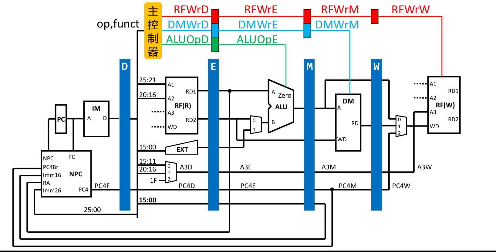

# 冒险

## 结构冒险

**征用同一个资源**

+ **取指令与访存**(IM cache/DM cache**)要分开**，否则会产生资源冲突
+ **RF 读数据与写数据要分开**， 读端口与写端口要分开，否则也会冲突

## 数据冒险

**指令之间的数据依赖，例如前面的Q1**

### 基于寄存器的数据相关

对于同一个寄存器来说，有**W-W  R-W  W-R**三种读写组合会残生冲突

## 控制冒险

