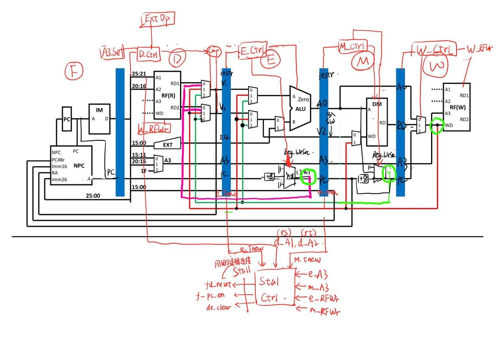

# 流水线CPU设计文档
## 设计草稿

注：框架来自 gxp 课件中的基本框架，在此基础上改造。

## 设计思路
分布式译码
 + 方便之处：每一级只传入这一级需要的控制信号（controller, 流水线寄存器）
 + 缺点：需要多次实例化Controller
控制器采用指令驱动型
1. 如果我把NPC作为计算PC地址的唯一来源，即PC一行的所有数据全由NPC计算出来，然后导入到PC中，会有什么问题吗
 + PC 必須「等待」整整一個週期，等當前指令流過 ID 級，NPC 才能給出答案。
为何不传PC+4
 + 因为PC值要始终传输，不如每一次需要时计算PC+4/8
## 命名规范
- 模块名：级别_模块名，如 F_PC, D_GRF
- 端口名：级别_端口名，如 F_PC_en, D_A1，一些特殊端口可省略级别前缀，如 clk, reset
- 寄存器名：两个级别_寄存器名，如 FD_Instr,
- 主文件中的临时wire信号：小写级别_信号名
- 功能部件 MUX 用 always 实现，转发 MUX 用 assign 语句实现。

## CONTROLLER (主控制器)
- **功能**: 根据指令的 opcode 和 funct 生成各级所需的控制信号。

| 端口名     | 位宽 | 方向 | 功能说明                                                     |
| ---------- | ---- | ---- | ------------------------------------------------------------ |
| opcode     | 6    | I    | 指令操作码                                                   |
| funct      | 6    | I    | R 型指令功能码                                               |
| RFWr    | 1    | O    |  寄存器写使能 (传递用)           |
| DMWr    | 1    | O    |  内存写使能 (传递用)              |
| ALUOp  | 3   | O    |  ALU 运算类型 (传递用)          |
| ExtOp   | 1    | O    | 立即数扩展方式 (传递用)        |
| CmpOp   | 3    | O    | 比较操作类型 D级比较信号用于跳转(取代Zero)   |
| Reg_WrSrc | 2    | O    |  寄存器写数据源选择 (传递用)       |
| ALU_BSrc  | 2    | O    |  ALU 第二操作数选择  |
| Reg_WrSel | 2    | O    |  写入寄存器地址选择         |
| T\_use\_RS | 2    | O    |  "RS 消费时间" (送往冒险控制器)    |
| T\_use\_RT | 2    | O    |  "RT 消费时间" (送往冒险控制器)    |

**每一级Controller生成的所需信息不同**
- D级：EXTOp，Reg_WrSrc
- E级：ALU_BSrc, Reg_WrSrc
## F级：IF (取指令) 阶段

本阶段负责获取当前指令。

### F_PC (Program Counter)
- **功能**: 保存当前指令地址。在流水线中，它需要接收下一地址（来自NPC MUX）。

| 端口名 | 位宽 | 方向 | 功能说明 |
| :--- | :--- | :--- | :--- |
| clk | 1 | I | 时钟信号 |
| reset | 1 | I | 同步复位信号 |
| F_PC_en | 1 | I | PC写使能（来自冒险控制器，用于暂停）1为可以写入 |
| F_NPC_in | 32 | I | 下一条指令地址（来自NPC MUX的最终选择） |
| F_PC | 32 | O | 当前PC地址（送往 IM 和 NPC） |

### F_IM (Instruction Memory)
- **功能**: 根据 PC 输出的地址，（组合逻辑）读出指令。

| 端口名 | 位宽 | 方向 | 功能说明 |
| :--- | :--- | :--- | :--- |
| A | 32 | I | 指令地址输入 (来自 `PC_out`)|
| F_Instr | 32 | O | 32位机器指令内容 (送往 `IF/ID` 寄存器) |

## FD_REG（D级流水线寄存器）
**暂停时本级无需清0，只需要使能信号为0即可保持原值。**
| 端口名 | 位宽 | 方向 | 功能说明 |
|--------|------|------|----------|
| clk    | 1    | I    | 时钟信号 |
| reset  | 1    | I    | 同步复位信号 |
| FD_en  | 1    | I    | 寄存器使能（0=保持/暂停，1=正常更新） |
| **（来自 F 级的输入）** |      |      |          |
| F_Instr | 32 | I  | 来自指令存储器（IM）的 32 位指令 |
| F_PC   | 32 | I  | 来自 IF 级的 PC 值(jal)  |
| **（输出到 D 级的信号）** |      |      |          |
| D_Instr | 32 | O  | 输出到 ID 级的 32 位指令 |
| D_PC   | 32 | O  | 输出到 ID 级的 PC 值  |

**PC值需要一直传递**

## D级：ID (译码/读寄存器) 阶段

本阶段负责译码、读取寄存器堆(RF)以及产生控制信号。

### Splitter (指令译码/拆分)
- **功能**: 将 FD_REG 传来的32位指令拆分为各个字段。
- **注意：该模块有两个实例，一个在D级读取拆分指令，获得rs,rt,rd,i16**
- **另一个在controller里实例，用于生成控制指令，因为实现的是分布式译码**
| 端口名 | 位宽 | 方向 | 功能说明 |
| :--- | :--- | :--- | :--- |
| Instr | 32 | I | 来自 `FD_REG`的指令 |
| opcode | 6 | O | 操作码 (送往相应控制器)  |
| rs | 5 | O | 源寄存器1 (送往 GRF A1) |
| rt | 5 | O | 源寄存器2 (送往 GRF A2 / A3 MUX)  |
| rd | 5 | O | 目的寄存器 (送往 A3 MUX)  |
| funct | 6 | O | 功能码 (送往相应控制器)  |
| i16 | 16 | O | 16位立即数 (送往 EXT) |
| i26 | 26 | O | 26位跳转立即数 (送往 `NPC`) |

### GRF (通用寄存器组)

| 端口名 | 位宽 | 方向 | 功能说明 |
| :--- | :--- | :--- | :--- |
| clk | 1 | I | 时钟信号 |
| reset | 1 | I | 同步复位 |
| A1 | 5 | I | 读端口 1 地址 (来自 `rs`)  |
| A2 | 5 | I | 读端口 2 地址 (来自 `rt`)  |
| RD1 | 32 | O | 读出的数据 1 (Value 1) |
| RD2 | 32 | O | 读出的数据 2 (Value 2) |
| A3 | 5 | I | **W级** 写入地址 (来自 `W_A3`)  |
| WD | 32 | I | **W级** 写入数据 (来自 WB MUX)|
| RFWr | 1 | I | **W级** 写入使能 (来自 W_Controller `W_RFWr`)|

### EXT (立即数扩展单元)
- **功能**: 将 16 位立即数扩展为 32 位。

| 端口名 | 位宽 | 方向 | 功能说明 |
| :--- | :--- | :--- | :--- |
| D_Imm16 | 16 | I | 16位立即数输入 (来自 Splitter) |
| D_ExtOp | 1 | I | 扩展操作选择 (来自 D_Controller) |
| D_E32 | 32 | O | 32位扩展结果 (Value 32) |

### A3_MUX (目的寄存器地址 MUX)
- **功能**: 根据指令类型（如 `P4` 中的 `RegDst` 信号），选择 `rt` 或 `rd` 或 `$ra(31)` 作为目的寄存器地址 `A3` [cite: 452]。

| 端口名 | 位宽 | 方向 | 功能说明 |
| :--- | :--- | :--- | :--- |
| D_rt | 5 | I | rt 寄存器地址 |
| D_rd | 5 | I | rd 寄存器地址 |
| D_RA31 | 5 | I | 31号寄存器，常数 | 
| D_Reg_WrSel | 2 | I | 目的寄存器选择信号 (来自 D_Controller) |
| D_RegDst | 5 | O | 最终的目的寄存器地址 (**一直往后送**)  |

- **注意：D_RegDst 生成后一直流水线传递到W级。**

### D_CMP (ID級比較器)
* **功能**: 在 ID 級執行对**转发过来的数据A1 A2**比較運算（例如 `beq` 的相等比較 ），提前生成分支是否跳轉的信號。

| 端口名 | 位寬 | 方向 | 功能描述 |
| :--- | :--- | :--- | :--- |
| `D_A1` | 32 | I | 來自 `rs` (A1) 的值，**是已處理轉發 (Forwarded) 後的最終值** |
| `D_A2[31:0]` | 32 | I | 來自 `rt` (A2) 的值，**是已處理轉發 (Forwarded) 後的最終值** |
| `CmpOp[2:0]` | 3 | I | 比較操作控制信號（来自 D_Controller） ，例如 `CMP_beq` |
| `D_bjump` | 1 | O | 比較結果 / 分支條件滿足標誌 (1=滿足, 0=不滿足)，此信號將送往 `NPC` 模塊進行下一PC決策 |

**注意：GRF读出的rs/rt值先转发，再连接到CMP和下一级寄存器**

### DF_NPC (Next Program Counter)

功能: 计算下一条指令地址 (PC+4 或分支目标地址)。

| 端口名 | 位宽 | 方向 | 功能说明 |
|---|---|---|---|
| F_PC[31:0] | 32 | I | F级获取的指令地址 |
| D_PC[31:0] | 32 | I | D级获取的流水指令地址，用于跳转PC+8 |
| D_imm26[25:0] | 26 | I | 26位立即数 |
| D_imm16[25:0] | 26 | I | 16位立即数 |
| D_RA[31:0]  | 32 | I | **转发后**$31保存的寄存器地址,**来自A1**|
| nPC_sel[1:0] | 2 | I | 下一 PC 选择信号 |
| `D_bjump` | 1 | I | 分支条件满足标志 (用于 beq 条件判断) |
| NPC[31:0] | 32 | O | 下一条指令地址 |

**注意RA需要先转发（例如汇编中保存寄存器的sp）**

---
## DE_REG（ID/EX 流水线寄存器）
锁存 ID 级（译码）的输出，作为 EX 级（执行）的输入。需传递所有数据和控制信号，并**支持「清空」以处理 `lw` 指令的加载延迟槽**。

| 端口名 | 位宽 | 方向 | 功能说明 |
|--------|------|------|----------|
| clk    | 1    | I    | 时钟信号 |
| reset  | 1    | I    | 同步复位信号 |
| DE_clr | 1    | I    | 寄存器清除（1=清零/插入nop，0=正常） |
| **（数据输入）** |      |      |          |
| D_V1   | 32   | I    | 来自 ID 级的 已转发过的RF 读出值 1（V1） |
| D_V2   | 32   | I    | 来自 ID 级的 已转发过的RF 读出值 2（V2） |
| D_E32  | 32   | I    | 来自 ID 级的 32 位立即数扩展结果 |
| **（地址输入）** |      |      |          |
| D_PC   | 32   | I    | 来自 ID 级的 PC 值 |
| D_A3   | 5   | I     | 来自 ID 级产生的写入寄存器地址 | 
| **（指令输入）包含rt,rd,rs地址）** |      |      |          |
| D_Instr | 32 | I | 来自FD_REG上一级的指令 |
| **（控制输入）** |      |      |          |
| **（数据输出）** |      |      |          |
| E_V1   | 32   | O    | 输出到 EX 级的 V1 |
| E_V2   | 32   | O    | 输出到 EX 级的 V2 |
| E_E32  | 32   | O    | 输出到 EX 级的 E32  |
| **（地址输入）** |      |      |          |
| E_PC   | 32   | O    | 输出到 EX 级的 当前指令地址 |
| E_A3   | 5   | O     | 输出到 EX 级的 写入寄存器地址 | 
| **（指令输出）** |      |      |          |
| E_Instr | 32   |   O   | 输出到EX一级的指令 |
| **（控制输出）** |      |      |          |
| E_Tnew   | 2    | O    | **生成** EX 级的 T_new 值 |

1. **注意暂停操作需要把这里清空**
2. **E_T_new在这里根据指令产生值。**
---

## E级：EX (执行) 阶段

本阶段主要负责算术逻辑运算。

### ALU (算术逻辑单元)
- **功能**: 执行运算。输入端需要**转发MUX**来接收来自 EX, MEM, WB 级的数据。

| 端口名 | 位宽 | 方向 | 功能说明 |
| :--- | :--- | :--- | :--- |
| A | 32 | I |   输入操作数 1 (来自**转发 MUX A**) |
| B | 32 | I |   输入操作数 2 (来自**转发 MUX B**) |
| E_ALUOp | 3 | I | 运算控制信号 (来自**E_Controller**) |
| E_AO | 32 | O | 运算结果 (ALU Out)|

### ALU_B_MUX   
- **功能**：选择ALU B输入端的数据: 转发过的V2 或者 E32。
  
| 端口名 | 位宽 | 方向 | 功能说明 |
| :--- | :--- | :--- | :--- |
| E_V2 | 32 | I | E级的第二个值V2(RD2)|
| E_ALU_BSrc | 2 | I | 选择信号| 
| E_ALUB | 32 | O | 输出到ALUB端的数值  |

### E_WD_MUX   
- **功能**：E级处，选择正确的寄存器写入值，即为转发出的值
这时，能产生正确写入值的指令只有PC类(jal)【**策略矩阵**】

| 端口名 | 位宽 | 方向 | 功能说明 |
| :--- | :--- | :--- | :--- |
| E_PC | 32 | I | 输入E级的指令当前地址|
| E_Reg_WrSrc| 2 | I | 选择信号（只有jal类信号有值，其他均为0 | 
| E_WD | 32 | O | E级处产生的写入值（只可能是PC+8，其他均为0） (**一直往后送**)  |

---
## EM_REG（EX/MEM 流水线寄存器）

| 端口名 | 位宽 | 方向 | 功能说明 |
|--------|------|------|----------|
| clk    | 1    | I    | 时钟信号 |
| reset  | 1    | I    | 同步复位信号 |
| **（指令输入）** |      |      |          |
| E_Instr | 32   |   O   | 来自EX一级的指令 |
| **（数据输入）** |      |      |          |
| E_AO    | 32   | I    | 来自 EX 级的 ALU 运算结果  |
| E_V2    | 32   | I    | 来自 EX 级的 V2 值（用于 sw 写入 DM） |
| E_PC    | 32   | I    | 来自 EX 级的 当前指令地址 |
| **（地址输入）** |      |      |          |
| E_A3    | 5    | I    | 来自 EX 级的 A3（目的寄存器）地址  |
| **（控制输入）** |      |      |          |
| E_Tnew    | 2    | I    | 来自 EX 级的 T_new 值 |
| **（指令输出）** |      |      |          |
| M_Instr | 32   |   O   | 输出到 MWM 级的指令 |
| **（数据输出）** |      |      |          |
| M_AO    | 32   | O    | 输出到 MEM 级的 ALU 结果 |
| M_V2    | 32   | O    | 输出到 MEM 级的 V2 值 |
| M_PC    | 32   | O    | 输出到 MEM 级的 当前指令地址（用于 jal 回写）  |
| **（地址输出）** |      |      |          |
| M_A3    | 5    | O    | 输出到 MEM 级的 A3 地址 |
| M_Tnew    | 2    | O    | 输出到 MEM 级的 T_new 值 **需要减一** |

1. **记得Tnew -1**
   
---

## M级：MEM (访存) 阶段

本阶段负责与数据存储器交互。

### M_DM (数据存储器)
- **功能**: 根据 `lw/sw` 指令进行数据读写。

| 端口名 | 位宽 | 方向 | 功能说明 |
| :--- | :--- | :--- | :--- |
| clk | 1 | I | 时钟信号 |
| reset | 1 | I | 同步复位 |
| A | 32 | I |   读/写地址 (来自 `EX/MEM.M_AO`) |
| M_WD | 32 | I |   写入数据 (来自 `EX/MEM.M_V2`) |
| DMWr | 1 | I |   写使能信号 (来自 M_Controller)  |
| M_RD | 32 | O |   读出数据  (送往 `MEM/WB`) |

### M_WD_MUX   
- **功能**：M级处，选择正确的寄存器写入值，即为可能转发出的值
这时，能产生正确写入值的指令有PC类(jal)和ALU类【**策略矩阵**】

| 端口名 | 位宽 | 方向 | 功能说明 |
| :--- | :--- | :--- | :--- |
| M_PC | 32 | I | 输入E级的指令当前地址|
| M_AO | 32 | I | 上一级计算的ALU结果 |    
| E_Reg_WrSrc| 2 | I | 选择信号 | 
| E_WD | 32 | O | E级处产生的写入值（**只可能是PC+8或ALU结果，其他为0**）  |

---
## MW_REG（MEM/WB 流水线寄存器）

流水线最后一级锁存。

| 端口名 | 位宽 | 方向 | 功能说明 |
|--------|------|------|----------|
| clk    | 1    | I    | 时钟信号 |
| reset  | 1    | I    | 同步复位信号 |
| **（指令输入）** |      |      |          |
| M_Instr | 32   |   O   | 来自 MEM 级的指令 |
| **（数据输入）** |      |      |          |
| M_AO    | 32   | I    | 来自 MEM 级的 ALU 结果 |
| M_RD    | 32   | I    | 来自 MEM 级的 DM 读出数据  |
| M_PC    | 32   | I    | 来自 MEM 级的 PC 值 |
| **（地址输入）** |      |      |          |
| M_A3    | 5    | I    | 来自 MEM 级的 A3（目的寄存器）地址 |
| **（指令输出）** |      |      |          |
| W_Instr | 32   |   O   | 输出到 WB 级的指令 |
| **（数据输出）** |      |      |          |
| W_AO    | 32   | O    | 输出到 WB 级的 ALU 结果  |
| W_RD    | 32   | O    | 输出到 WB 级的 DM 读出数据  |
| W_PC    | 32   | O    | 输出到 WB 级的 PC 值|
| **（地址输出）** |      |      |          |
| W_A3    | 5    | O    | 输出到 WB 级的 A3 地址 |

1. **Tnew一定减为0了**
---
## W级：WB (回写) 阶段

本阶段负责将最终结果写回寄存器堆(GRF)。

### WB_MUX (回写 MUX)
-   **功能**: 选择写回 GRF 的数据来源：是来自 ALU 的结果 (`M_AO`) 还是来自 DM 的结果 (`M_RD`)  还是 PC+8 (`M_PC`)(jal)

| 端口名 | 位宽 | 方向 | 功能说明 |
| :--- | :--- | :--- | :--- |
| AO_W | 32 | I | 来自 `MEM/WB` 的 ALU 结果 |
| DR_W | 32 | I | 来自 `MEM/WB` 的内存读出数据 |
| M_PC | 32 | I | 当前指令值 | 
| Reg_WrSel | 2 | I | 写回数据源选择信号 (来自 `MEM/WB`) |
| W_WD | 32 | O |   最终写回 RF 的数据  |

---

## 流水线专用部件

这些是实现流水线所**必须新增**的模块。

### 数据冲突表

### 表格1：$T_{\text{use}}$ 表
|      | $T_{\text{use}}$ |         |
| :--- | :--------------- | :------ |
|      | rs               | rt      |
| add  | 1                | 1       |
| sub  | 1                | 1       |
| andi | 1                |         |
| ori  | 1                |         |
| lw   | 1                |         |
| sw   | 1                | 2       |
| beq  | 0                | 0       |
| jr   | 0                |         |
|      |                  |         |
|      | {0,1}            | {0,1,2} |

### 表格2：指令、功能部件与 $T_{\text{new}}$ 表
| 指令 | 功能部件 | $T_{\text{new}}$ |      |      |
| :--- | :------- | :--------------- | :--- | :--- |
|      |          | E                | M    | W    |
| add  | ALU      | 1                | 0    | 0    |
| sub  | ALU      | 1                | 0    | 0    |
| andi | ALU      | 1                | 0    | 0    |
| ori  | ALU      | 1                | 0    | 0    |
| lw   | DM       | 2                | 1    | 0    |
| lui  | ALU      | 1                | 0    | 0    |
| sw   |          |                  |      |      |
| beq  |          |                  |      |      |
| jal  | PC       | 0                | 0    | 0    |

### 表格3：策略矩阵
#### rs策略矩阵
| $T_{\text{use}} \ \backslash \ T_{\text{new}}$ | E（ALU） | E（DM） | E（PC） | M（ALU） | M（DM） | M（PC） | W（ALU） | W（DM） | W（PC） |
| :--------------------------------------------- | :------- | :------ | :------ | :------- | :------ | :------ | :------- | :------ | :------ |
| 0                                              | S        | S       | F       | F        | S       | F       | F        | F       | F       |
| 1                                              | F        | S       | F       | F        | F       | F       | F        | F       | F       |

#### rt策略矩阵
| $T_{\text{use}} \ \backslash \ T_{\text{new}}$ | E（ALU） | E（DM） | E（PC） | M（ALU） | M（DM） | M（PC） | W（ALU） | W（DM） | W（PC） |
| :--------------------------------------------- | :------- | :------ | :------ | :------- | :------ | :------ | :------- | :------ | :------ |
| 0                                              | S        | S       | F       | F        | S       | F       | F        | F       | F       |
| 1                                              | F        | S       | F       | F        | F       | F       | F        | F       | F       |
| 2                                              | F        | F       | F       | F        | F       | F       | F        | F       | F       |

### HazardCtrl (数据冲突控制器)
-   **功能**: 核心模块。根据**生产-消费模型**   和**策略矩阵** 生成暂停和转发信号。

| 端口名 | 位宽 | 方向 | 功能说明 |
| :--- | :--- | :--- | :--- |
| D_T_use_RS, D_T_use_RT | 2 | I |   D级指令的 "消费时间" |
| E_Tnew, M_Tnew | 2 | I |   E级和M级指令的 "生产时间" |
| D_A1, D_A2 | 5 | I | D级读取的寄存器地址 |
| E_A3, M_A3| 5 | I |   E, M级的目的寄存器地址  |
| E_RFWr, M_RFWr| 1 | I |   E, M级的写使能信号 |
| Stall | 1 | O |   暂停信号 (送往 PC 和 IF/ID 寄存器)  |
| Fwd_D_RS_Sel | 2 | O |   D级rs通路的比较/转发选择（0=原值，1=来自E，2=来自M） |
| Fwd_D_RT_Sel | 2 | O |   D级rt通路的比较/转发选择信号 |
| E_Fwd_A_Sel | 2 | O |   ALU A端转发MUX控制信号 |
| E_Fwd_B_Sel | 2 | O |   ALU B端转发MUX控制信号 |
| Fwd_M_WD_Sel | 2 | O |   DM写数据端口的前递MUX控制（0=E_V2，1=E结果，2=WB） |

### Forwarding_MUXes (转发 MUX)

-   **功能**: 位于 EX 级 ALU 的输入端，根据冒险控制器的信号，选择正确的数据来源。
-   D级的RF后 rs、rt各需要一个转发：Fwd_D_RS、Fwd_D_RT
-   E级的ALU A B端各需要一个转发: Fwd_E_ALUA、Fwd_E_ALUB
-   M级 DM处的WD输入需要一个转发: Fwd_M_WD
转发信息来源：

- E_WD: EX/MEM级是jal类指令，在该级产生正确结果，需要传递PC+8（其他的指令Tnew != 0）
- M_WD: MEM/WB是jal、计算类指令，在该级产生正确结果，需要传递PC+8/ALU结果
- W_WD: 所有指令在该级已经产生正确结果，需要传递ALU结果。

以Fwd_E_ALUB为例
| 端口名 | 位宽 | 方向 | 功能说明 |
| :--- | :--- | :--- | :--- |
| E_V2 | 32 | I |   来源0：ID/EX 寄存器的 V2 值 (默认)  |
| M_WD | 32 | I |   来源2：MEM/WB 的写入数据 |
| W_WD | 32 | I |   来源3：WB 的写入数据 |
| Fwd_B_Sel | 2 | I | 选择信号 (来自 Hazard Controller) |
| ALU_B | 32 | O |   最终送往 ALU B端的数据 [cite: 457] |

## 思考题

1. 提前分支判断虽然旨在将控制冒险的开销降到最小，但其代价是使得分支指令在 `D` 级就成为了数据的消费者，这极大地增强了数据冒险的敏感性；具体来说，当分支指令的判断条件依赖于其紧前一条 `lw`（加载）指令的結果时，流水线将被迫强制插入一拍 `Load-Use` 暂停，降低了整体效率；例如指令序列 `lw $t0, 0($s0)` 紧接 `beq $t0, $t1, Target` 

2. 由于延迟槽的存在，jal指令执行时下一条指令已经进入流水线，此时PC已经指向PC+8的位置，因此jal需要写回PC+8而不是PC+4，这样才能正确保存返回地址。

3. 转发数据必须来自流水线寄存器而不能直接来自功能单元，因为流水线寄存器在时钟边沿锁存数据，保证了时序一致性。如果直接从ALU或DM读取，可能读取到中间不稳定状态的数据，导致竞争冒险和时序错误。

4. 当同一周期内需要对通用寄存器堆（GRF）的同一个寄存器同时执行读操作与写操作时，由于寄存器的写操作仅在时钟上升沿触发，导致此时从该寄存器读出的数据为未更新的旧值。为解决这一问题，需引入转发机制：在 GPR 的 RD1（第一读端口）和 RD2（第二读端口）处分别增设转发多路选择器（MUX），通过选择器筛选出最新的有效数据（而非旧值），确保流水线能正确处理后续操作。

5. 数据请求者可能来自D级的GRF读端口（rs/rt用于比较和转发）、E级ALU输入端（A/B操作数）、M级DM写端口（sw指令的写入数据）。转发数据路径包括E_WD（E级产生的PC+8）、M_WD（M级产生的PC+8或ALU结果）、W_WD（W级最终写回数据），通过Fwd_D_RS、Fwd_D_RT、Fwd_E_ALUA、Fwd_E_ALUB、Fwd_M_WD等转发MUX选择。

6. 新指令扩展需要分类处理：计算类指令需要扩展Controller的ALUOp和T_new/T_use信号，可能需要在E级添加新的ALU功能；访存类指令需要扩展DMWr和Reg_WrSrc信号；跳转类指令需要扩展NPC的nPC_sel和CmpOp信号；特殊指令可能需要新增数据路径或修改转发策略矩阵。关键修改点包括Controller译码逻辑、Hazard_Controller的冒险检测、各级转发MUX的数据源选择。

7. 采用分布式译码架构，每一级独立实例化Controller，只生成该级所需控制信号。D级Controller生成ExtOp、Reg_WrSrc、CmpOp等；E级Controller生成ALUOp、ALU_BSrc、Reg_WrSrc等；M级和W级Controller生成相应控制信号。优点是每级只传递必要信号，减少流水线寄存器宽度，模块化程度高；缺点是Controller需要多次实例化，但通过统一的设计可以保证一致性。
