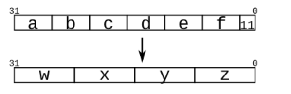

# Verilog 入门2  HDLbits 教程

## 入门

+ Module 的定义
+ assign 与 直接`=`的区别

## 基础

1. Wire 类型： **默认类型** 如`output o1`默认指的就是wire类型
   + 有向性：在`continious assignment`中默认将右面的信息转递给左面
   + 使用`Assign`语句来用某个常数、变量、Wire**持久驱动**Wire 类型**（实时传递）**

2. 逻辑门： 
   - `~` 按位非， `!`逻辑非
   - `^ | ~ &` 可作为单目运算符，表示把一个向量按位运算  如`assign out = &in;`

## 向量

1. 未定义直接`assign`的隐式变量为 net类型 是 单位数据，尽量不要这么做 加上这句话后减少此类错误`default_nettype none `
2. 区分向量与Array 如：`reg[7:0] mem [255:0];`
3. **不允许翻转矢量位排序**
4. **串联运算符**
   + 组件长度必须标出来 不能单独一个数字
   + 可用于赋值的左侧和右侧。**甚至可以两侧同时串联，如**` assign {w, x, y, z} = {a, b, c, d, e, f, 2'b11};`表示
   + **复制**`{num{vector}}` num必须为常数
   + **和其他信号、常量一起放在串联中**`  assign out ={24{in[7]}, in}; ` **要在套一层大括号**

## 模块 Module

1. 模块实例化： 位置映射和名字映射，前者需要注意端口定义顺序，后者不需要
